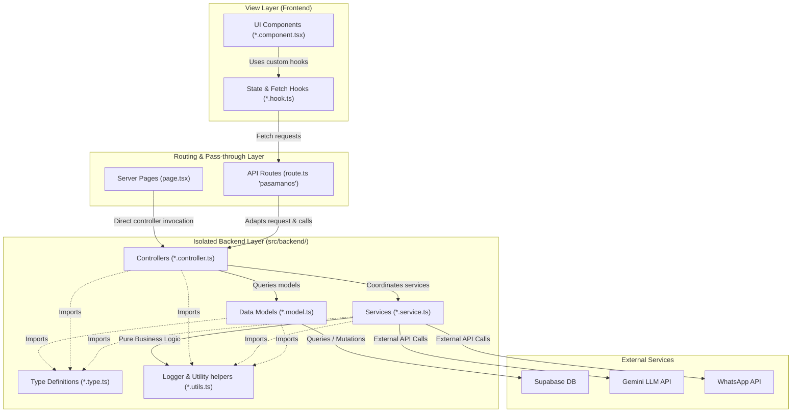

# Architecture

This project is a Next.js 16 App Router application. Architecture decisions should
favor the framework conventions documented in `node_modules/next/dist/docs/` over
older Next.js memory.

## Principles & Decoupled MVC Architecture

To achieve a highly scalable, clean, and maintainable codebase, we implement a strict **Decoupled MVC (Model-View-Controller)** pattern where the Backend is isolated (`src/backend`) and operates independently of the frontend UI:

*   **View (Vista - Frontend)**: Exposes exclusively visual components, layouts, custom hooks, and local UI state (`src/app` and `src/components`).
    *   *Rules*: Views are strictly decoupled from database models and third-party API clients. They MUST NOT connect directly to Supabase, Gemini, or other external APIs. Instead, they interact exclusively with local API routes or custom Hooks (`src/hooks/*`) for data fetching.
*   **Controller (Controlador - Pasamanos & Backend Controllers)**: Next.js local API endpoints (`src/app/api/*`) act as thin pass-through adapters ("pasamanos"). They accept HTTP requests, parse query/body inputs, delegate actual routing logic immediately to controllers in `src/backend/controllers/`, and return formatted HTTP responses.
*   **Model & Service (Modelo/Servicio - Backend)**: Isolated under `src/backend/`. Models handle data schema constraints and raw database operations (Supabase). Services implement pure core business logic, calculations, metrics, and external integrations (such as the Gemini LLM API).

---

## Project Structure (`src/`)

All files and directory paths in the workspace MUST be written strictly in **lowercase**. This definitively prevents path resolution case-sensitivity failures during production builds or in Linux-based deployment environments (e.g. Vercel):

```text
src/
├── app/                           # VIEW LAYER / ROUTING (Next.js App Router)
│   ├── api/                       # Internal API Pass-throughs ("pasamanos")
│   │   └── v1/
│   │       ├── traffic/route.ts   # GET -> Invokes traffic.controller.ts
│   │       └── ai/route.ts        # POST -> Invokes ai.controller.ts
│   ├── admin/                     # Manager and Cashier private routes
│   │   ├── dashboard/page.tsx     # Uses chart.component.tsx via hooks
│   │   └── cash/page.tsx
│   ├── portal/                    # Public client views (WiFi Captive / Forms)
│   └── layout.tsx                 # App layout configuration
│
├── components/                    # REUSABLE UI INTERFACE COMPONENTS
│   ├── ui/                        # Atomic components (button, input, card)
│   ├── traffic/                   # Domain components for traffic metrics
│   │   └── chart.component.tsx
│   └── wifi/
│       └── qr.component.tsx       # Qr code visualizer component
│
├── hooks/                         # FRONTEND STATE & FETCH ABSTRACTION LAYER
│   ├── use-traffic.hook.ts        # Orchestrates network fetch & UI states
│   └── use-wifi.hook.ts           # Handles WiFi portal state logic
│
└── backend/                       # ISOLATED BACKEND LAYER (Easily extractable)
    ├── controllers/               # HTTP coordinators and input validators
    │   ├── traffic.controller.ts
    │   └── ai.controller.ts
    ├── models/                    # DB querying / Supabase data modeling
    │   ├── supabase.model.ts      # Instantiated secure Supabase client
    │   └── client.model.ts        # Customer and traffic query operations
    ├── services/                  # Business logic / Outbound API clients
    │   ├── ai.service.ts          # Integrations with Gemini / LLM SDKs
    │   └── whatsapp.service.ts    # Notification engine via WhatsApp URLs
    ├── types/                     # Shared backend models and database types
    │   └── database.type.ts       # Generated Supabase types interface
    └── utils/                     # Logger and utility libraries
        └── logger.utils.ts        # Portable stdout/stderr logger
```

---

## Decoupled Backend Layers (`src/backend/`)

1. **Controllers (`src/backend/controllers/`)**: Parse HTTP input parameters, invoke backend services and data models, wrap processing logic in robust try/catch blocks, and return uniform JSON payloads.
2. **Services (`src/backend/services/`)**: Run calculations and orchestrate API connections (Gemini, WhatsApp) without being bound to database schemas or controller states.
3. **Models (`src/backend/models/`)**: Handle Supabase transactions. They implement simulated offline fallback handlers to keep development fast.
4. **Types (`src/backend/types/`)**: Centralize static TypeScript interface definitions and auto-generated database schemas.
5. **Utils (`src/backend/utils/`)**: Provide shared pure helpers, formatting utilities, and logger instances.

### System Architecture Flow

The following Mermaid diagram visualizes the flow of data, API request lifecycles, and structural dependencies across layers:




---

## Developer Tooling & Token Savings

The project integrates standard local development tools. Agents and developers MUST use these local script aliases rather than executing generic shell commands, installing global programs, or requesting manual code parses. This reduces context token overhead and prevents directory exploration:

1. **`pnpm rg <query> [path]` (ripgrep)**: Fast, token-efficient text search wrapper. Use this instead of listing directories or executing heavy bash loops to locate files.
2. **`pnpm jq <filter> <file>` (jq)**: Local JSON parser. Allows extracting precise parts of config files (e.g. `package.json`, `feature_list.json`) directly in terminal.
3. **`pnpm hygen <generator> <action> --name <name>` (hygen)**: Scaffolds folders and boilerplate following repository rules.
   - `pnpm hygen component new --name <name>`: Scaffolds a new UI component with its test file.
   - `pnpm hygen test new --name <name>`: Scaffolds an integration test with requirement traceability comments.
4. **`pnpm db:*` (Supabase Local Wrapper)**:
   - `pnpm db:init` / `pnpm db:start` / `pnpm db:stop` / `pnpm db:status`: Complete local DB instance control.
   - `pnpm db:gen-types`: Generates type definitions directly into `src/backend/types/database.type.ts`.
   - `pnpm db:lint`: Static analysis check for migrations.
5. **`pnpm vercel:*` (Deployment Wrapper)**:
   - `pnpm vercel:pull` / `pnpm vercel:build` / `pnpm vercel:deploy`: Clean Vercel environment pulls and builds.

---

## What not to do

- Do not add a `pages/` router unless a spec explicitly calls for Pages Router.
- Do not bypass the Decoupled Backend layers (e.g. calling Supabase directly from an API route or page component; use Models and Controllers instead).
- Do not introduce a data layer, service layer, ORM, or state library without a feature requirement and design note.
- Do not use client components as the default for pages and layouts.
- Do not rely on remote docs when the relevant local Next.js docs are available in `node_modules/next/dist/docs/`.
- Do not install global CLI tools or write complex custom shell adapters for database/deployment operations; use the unified package scripts.
- Do not bypass `hygen` when creating components or test boilerplate; using templates guarantees styling and testing compliance.

