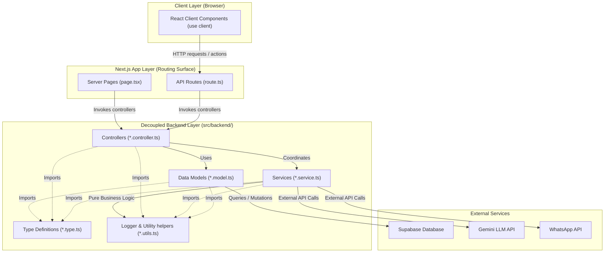

# Architecture

This project is a Next.js 16 App Router application. Architecture decisions should
favor the framework conventions documented in `node_modules/next/dist/docs/` over
older Next.js memory.

## Principles

1. Use `app/` as the routing surface. A route is public only when a segment contains
   `page.tsx` or `route.ts`.
2. Prefer Server Components. Add `"use client"` only for state, effects, browser
   APIs, event handlers, or client-only hooks.
3. Keep route-local implementation colocated with the route when it serves only that
   route. Use private folders such as `_components`, `_lib`, or `_hooks` for files
   that must not become routes.
4. Put shared UI or domain utilities outside a route segment only when at least two
   routes need them.
5. Use `route.ts` for App Router API endpoints. Keep request parsing, validation,
   and response shaping explicit.
6. Use `public/` only for static assets that must be served directly.
7. Avoid adding dependencies unless the feature spec explains why the platform or
   existing dependencies are not enough.

## Current shape

- `src/app/`: The routing surface (layouts, pages, API routes).
  - `layout.tsx` defines the root document and font setup.
  - `page.tsx` exposes `/`.
  - `globals.css` contains global styles and Tailwind.
- `src/backend/`: Decoupled backend architecture (controllers, models, services, types, utils).
- `public/`: Static SVG and image assets.
- `tests/integration/`: Vitest integration tests (pure logic, data flow, controllers, services).
- `tests/e2e/`: Playwright E2E tests (real browser user-flows; only with human approval).

---

## Decoupled Backend Layers (`src/backend/`)

To keep the application highly maintainable, business logic and data access are decoupled from the routing layer:

1. **Controllers (`src/backend/controllers/`)**: Handle HTTP / routing requests, parse and validate input parameters, coordinate service calls, and shape success or failure responses.
2. **Services (`src/backend/services/`)**: Implement pure business logic, calculations, and integrations with external systems (e.g., Gemini AI, WhatsApp gateways). They are fully decoupled from database models and HTTP contexts.
3. **Models (`src/backend/models/`)**: Isolate database queries and mutations (using Supabase). Ensure proper fallback simulations exist for offline-first development.
4. **Types (`src/backend/types/`)**: Centralize TypeScript interface definitions and auto-generated database schemas.
5. **Utils (`src/backend/utils/`)**: Provide shared pure helpers, formatting utilities, and logger instances.

### System Architecture Flow

The following Mermaid diagram visualizes the flow of data and dependencies across the application layers:

---

## Developer Tooling & Token Savings

The project integrates standard local development tools. Agents and developers MUST use these local script aliases rather than executing generic shell commands, installing global programs, or requesting manual code parses. This reduces context token overhead and prevents directory exploration:

1. **`pnpm rg <query> [path]` (ripgrep)**: Fast, token-efficient text search wrapper. Use this instead of listing directories or executing heavy bash loops to locate files.
2. **`pnpm jq <filter> <file>` (jq)**: Local JSON parser. Allows extracting precise parts of config files (e.g. `package.json`, `feature_list.json`) directly in terminal.
3. **`pnpm hygen <generator> <action> --name <name>` (hygen)**: Scaffolds folders and boilerplate following repository rules.
   - `pnpm hygen component new --name <name>`: Scaffolds a new UI component with its test file.
   - `pnpm hygen test new --name <name>`: Scaffolds an integration test with requirement traceability comments.
4. **`pnpm db:*` (Supabase Local Wrapper)**:
   - `pnpm db:init` / `pnpm db:start` / `pnpm db:stop` / `pnpm db:status`: Complete local DB instance control.
   - `pnpm db:gen-types`: Generates type definitions directly into `src/backend/types/database.type.ts`.
   - `pnpm db:lint`: Static analysis check for migrations.
5. **`pnpm vercel:*` (Deployment Wrapper)**:
   - `pnpm vercel:pull` / `pnpm vercel:build` / `pnpm vercel:deploy`: Clean Vercel environment pulls and builds.

---

## What not to do

- Do not add a `pages/` router unless a spec explicitly calls for Pages Router.
- Do not bypass the Decoupled Backend layers (e.g. calling Supabase directly from an API route or page component; use Models and Controllers instead).
- Do not introduce a data layer, service layer, ORM, or state library without a feature requirement and design note.
- Do not use client components as the default for pages and layouts.
- Do not rely on remote docs when the relevant local Next.js docs are available in `node_modules/next/dist/docs/`.
- Do not install global CLI tools or write complex custom shell adapters for database/deployment operations; use the unified package scripts.
- Do not bypass `hygen` when creating components or test boilerplate; using templates guarantees styling and testing compliance.

