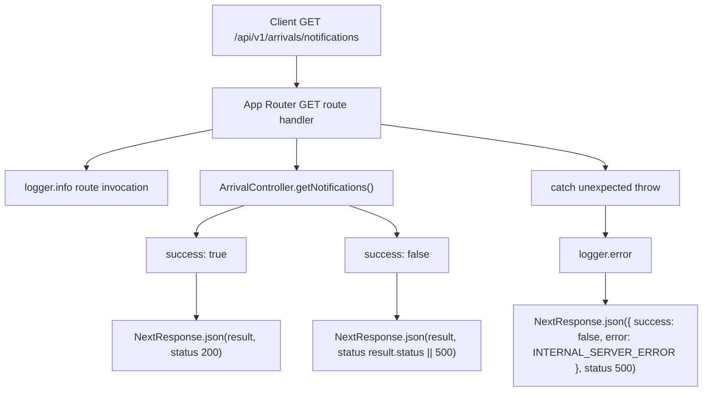

# Design - api_arrival_notifications_route (Feature ID: 54)

## Overview

`api_arrival_notifications_route` exposes the completed arrival notifications controller through a thin Next.js App Router endpoint. The route stays in the routing layer only: it logs the request, calls `ArrivalController.getNotifications()`, maps the controller envelope to `NextResponse.json`, and protects callers from route-level unexpected exceptions.

## Affected Files

| Action | File | Reason |
| --- | --- | --- |
| New | `src/app/api/v1/arrivals/notifications/route.ts` | Add the GET App Router pasamanos endpoint for arrival notification alerts. |
| New | `tests/integration/api_arrival_notifications_route.integration.test.ts` | Verify route export, controller delegation, JSON response mapping, and route-level fallback behavior. |

## Public Interface

```typescript
export async function GET(): Promise<Response>;
```

- **Endpoint:** `GET /api/v1/arrivals/notifications`
- **Request body:** None.
- **Success response:** HTTP 200 with the exact success payload returned by `ArrivalController.getNotifications()`.
- **Controller error response:** HTTP `result.status || 500` with the exact controller error payload.
- **Unexpected route exception response:** HTTP 500 with `{ success: false, error: "INTERNAL_SERVER_ERROR" }`.

## Architecture and Data Flow



## Behavior

- The route file defines only the HTTP methods required by this feature: a named `GET` export.
- The handler imports `NextResponse` from `next/server`, `ArrivalController` from the backend controller layer, and the shared `logger`.
- The handler does not parse a request body or query parameters because the feature acceptance only requires recent arrival notification retrieval.
- The handler logs a stable route invocation message before invoking the controller.
- The handler awaits `ArrivalController.getNotifications()` and treats the controller's `success` flag as the response status switch.
- Success responses always use HTTP 200, preserving the full controller payload.
- Controlled controller errors use `result.status || 500`, preserving the full controller payload.
- Unexpected route-level exceptions are caught, logged, and mapped to the stable internal error payload.

## Error Handling

| Scenario | HTTP status | Response body |
| --- | --- | --- |
| Controller returns `{ success: true, data: ... }` | 200 | Full controller payload |
| Controller returns `{ success: false, status: N, error: "..." }` | `N` | Full controller payload |
| Controller returns `{ success: false, error: "..." }` | 500 | Full controller payload |
| Controller throws | 500 | `{ success: false, error: "INTERNAL_SERVER_ERROR" }` |

## Testing Strategy

Use Vitest integration tests that import the route handler directly and mock/spyon controller and logger methods:

- Assert the route exposes a callable `GET` function.
- Mock a success response containing `notifications` and `summary`; assert HTTP 200 and unchanged JSON.
- Assert `ArrivalController.getNotifications()` is called once without request arguments.
- Assert `logger.info` is called for the route invocation.
- Mock a controlled controller error with status 500 and assert JSON/status propagation.
- Mock a controlled controller error without a status and assert status defaults to 500.
- Mock an unexpected thrown exception and assert `logger.error`, HTTP 500, and `INTERNAL_SERVER_ERROR`.

## Decisions and Alternatives

| Decision | Chosen approach | Alternative considered | Rationale |
| --- | --- | --- | --- |
| Route shape | Named `GET` export in `route.ts` | Use a generic request switch inside one exported handler | Next.js App Router route files use named HTTP method exports, and this feature only needs GET. |
| Controller delegation | Call `ArrivalController.getNotifications()` directly | Query models or services in the route | Direct model/service use would violate the decoupled MVC pasamanos boundary in `docs/architecture.md`. |
| Request parsing | No body or query parsing | Accept a `limit` query parameter now | Feature 53 owns bounded recent arrivals and feature 54 acceptance only requires recent logins; extra query behavior would exceed scope. |
| Error fallback | Catch unexpected route exceptions | Rely entirely on controller error envelopes | Existing route specs use defensive route-level fallback so callers always receive JSON even if the controller throws. |

## Next.js Docs Consulted

- `node_modules/next/dist/docs/01-app/01-getting-started/15-route-handlers.md`
- `node_modules/next/dist/docs/01-app/03-api-reference/03-file-conventions/route.md`

These docs confirm App Router `route.ts` placement, named HTTP method exports, supported `GET` handlers, and JSON response support through Web/Next response APIs.
