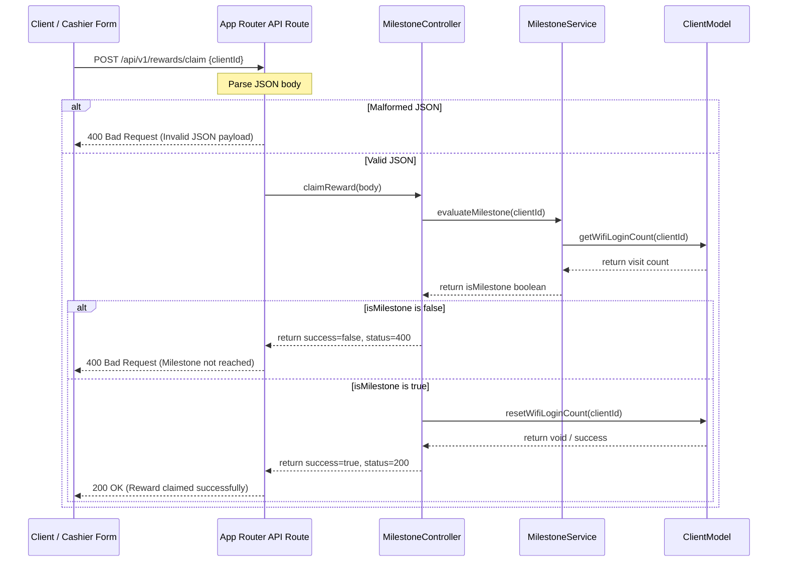

# Design — api_reward_claim_route (Feature ID: 60)

This document details the architectural decisions, data flow, and public interfaces for the Milestone Reward Claim API route.

## Architectural Design

The API route acts as a thin wrapper (a "Pasamanos") that translates standard HTTP requests into controller calls and formats controller outputs into valid HTTP NextResponses. It ensures proper decoupling of routing logic from core domain and validation logic.

### Affected Files

- **`[NEW]` [route.ts](file:///Users/juarpla/Documents/Code%20Practice/loyalty/src/app/api/v1/rewards/claim/route.ts)**: Implements the `POST` route handler.
- **`[NEW]` [api_reward_claim_route.integration.test.ts](file:///Users/juarpla/Documents/Code%20Practice/loyalty/tests/integration/api_reward_claim_route.integration.test.ts)**: Covers the integration tests validating routing, validations, and database errors.

## Public Interface & Data Formats

### POST `/api/v1/rewards/claim`

- **Content-Type**: `application/json`
- **Request Payload**:
  ```json
  {
    "clientId": "test-client-id"
  }
  ```
  *(Also supports `client_id` via the controller's validation fallback).*

- **Success Response (200 OK)**:
  ```json
  {
    "success": true,
    "status": 200,
    "data": {
      "message": "Reward claimed successfully"
    }
  }
  ```

- **Error Responses**:
  - **400 Bad Request (Malformed JSON)**:
    ```json
    {
      "success": false,
      "status": 400,
      "error": "Invalid JSON payload"
    }
    ```
  - **400 Bad Request (Business/Validation Failure)**:
    ```json
    {
      "success": false,
      "status": 400,
      "error": "Validation failed: Milestone not reached"
    }
    ```
  - **500 Internal Server Error**:
    ```json
    {
      "success": false,
      "status": 500,
      "error": "DB_CONNECTION_FAILURE"
    }
    ```

## Data Flow & Error Handling



## Next.js Guides Consulted

- Next.js App Router API Route handlers: `node_modules/next/dist/docs/01-app/01-getting-started/03-layouts-and-pages.md`
- NextResponse JSON helpers: `node_modules/next/dist/docs/01-app/01-getting-started/05-server-and-client-components.md`

## Tradeoffs & Rejected Alternatives

- **Direct Model Invocation inside the Route**: Calling `ClientModel` or `MilestoneService` directly from the App Router file instead of through `MilestoneController`.
  - *Reason for rejection*: Violates the single responsibility principle and separation of layers. Keeping a unified controller ensures consistent logging, validation, error bubble-up, and keeps the HTTP routing files extremely thin and readable.
