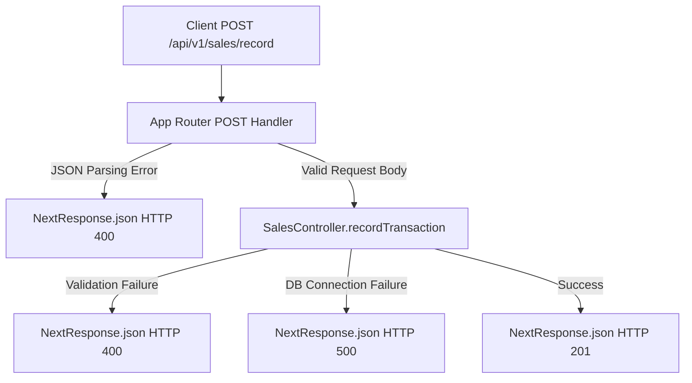

# Design - api_sales_record_route (Feature ID: 5)

## Affected Files
- [NEW] [route.ts](file:///Users/juarpla/Documents/Code%20Practice/loyalty/src/app/api/v1/sales/record/route.ts): Exposes the HTTP POST App Router endpoint.
- [NEW] [api-sales-record-route.integration.test.ts](file:///Users/juarpla/Documents/Code%20Practice/loyalty/tests/integration/api-sales-record-route.integration.test.ts): Integration tests to verify request parsing, successful controller delegation, and HTTP status/header mapping.

## Architecture & Data Flow
Following Next.js App Router conventions:
- Incoming `POST` requests to `/api/v1/sales/record` are processed by the handler.
- The body is extracted using `request.json()`.
- Validations and DB operations are delegated to `SalesController.recordTransaction`.
- The controller response status determines the `NextResponse.json` payload and status.

## Decisions & Alternatives
- **Request Body Parsing Robustness**: The handler will wrap `request.json()` inside a try-catch block. If the JSON is malformed or missing, it will directly return a 400 status instead of allowing the runtime to crash or return a generic 500 error.
- **Status Delegation**:
  - Success returns **201 Created** to conform to RESTful patterns for resource creation.
  - Failure status codes are extracted directly from the controller's returned packet (`result.status || 500`) to keep the routing layer extremely thin and clean.
