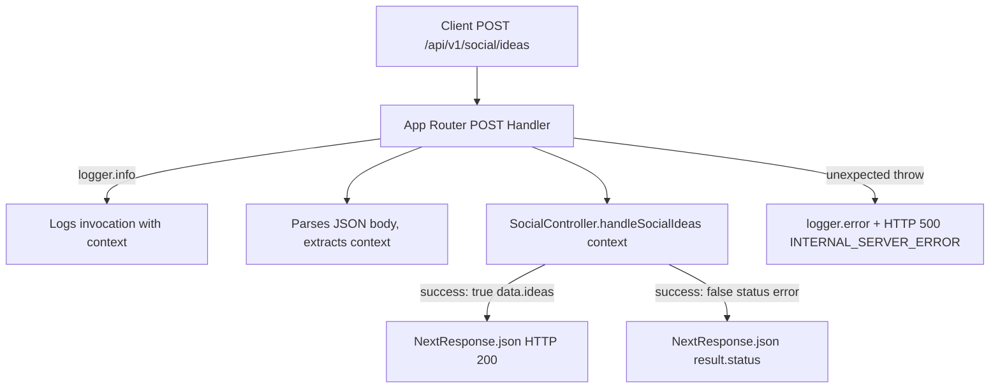

# Design - api_social_ideas_route (Feature ID: 34)

## Affected Files

| File | Action | Description |
|------|--------|-------------|
| `src/app/api/v1/social/ideas/route.ts` | **Create** | New App Router API route — POST handler pasamanos |
| `tests/integration/api_social_ideas_route.test.ts` | **Create** | Integration tests for all requirement coverage |

## Public Interface

### `POST /api/v1/social/ideas`

**Request body:**
```typescript
{
  "context": string  // Business context description, min 3 chars (validated by controller)
}
```

**Success response (200):**
```typescript
{
  "success": true,
  "data": {
    "ideas": [
      {
        "title": string,
        "body": string,
        "visualPrompt": string,
        "hashtags": string[]
      }
    ]
  }
}
```

**Validation error response (400) — from controller:**
```typescript
{
  "success": false,
  "error": "Context must be at least 3 characters long"
}
```

**Server error response (500) — from controller error:**
```typescript
{
  "success": false,
  "error": "Internal server error"
}
```

**Unexpected exception fallback (500) — from route catch:**
```typescript
{
  "success": false,
  "error": "INTERNAL_SERVER_ERROR"
}
```

## Architecture & Data Flow

Following the pasamanos pattern established in F25 (`api_promotions_generate_route`), the route is a thin pass-through:



- The POST handler is the only exported function.
- The `context` string is extracted from `request.json()`.
- No validation is done in the route — it delegates entirely to the controller, consistent with the pasamanos pattern.
- The controller's response shape (`{ success, data?/error?, status? }`) determines the HTTP response.

## Route Implementation Template

```typescript
import { NextResponse } from "next/server";
import { SocialController } from "../../../../../backend/controllers/social.controller";
import { logger } from "../../../../../backend/utils/logger.utils";

export async function POST(request: Request) {
  try {
    const { context } = await request.json();
    logger.info("POST /api/v1/social/ideas API route invoked", { context });

    const result = await SocialController.handleSocialIdeas(context);

    if (!result.success) {
      return NextResponse.json(result, { status: result.status || 500 });
    }

    return NextResponse.json(result, { status: 200 });
  } catch (error) {
    logger.error("Unexpected error in POST /api/v1/social/ideas", error);
    return NextResponse.json(
      { success: false, error: "INTERNAL_SERVER_ERROR" },
      { status: 500 }
    );
  }
}
```

### Import Path

The relative import path `../../../../../backend/controllers/social.controller` is calculated from the route file depth at `src/app/api/v1/social/ideas/route.ts` — four directory levels up to reach `src/`, then into `backend/`.

## Error Handling

| Scenario | HTTP Status | Response Shape |
|---|---|---|
| Controller returns `{ success: true, data: { ideas: [...] } }` | 200 | Full controller payload |
| Controller returns `{ success: false, status: 400, error: "..." }` | 400 | Full controller payload |
| Controller returns `{ success: false, status: 500, error: "..." }` | 500 | Full controller payload |
| Route-level unexpected exception (JSON parse error, controller import crash, etc.) | 500 | `{ success: false, error: "INTERNAL_SERVER_ERROR" }` |

## Dependencies

- `@/backend/controllers/social.controller` — exists (F33 done), exposes `SocialController.handleSocialIdeas(context)`
- `@/backend/utils/logger.utils` — exists (F65 done), exposes `logger.info` and `logger.error`

## Next.js Docs Consulted

- Route Handlers: `node_modules/next/dist/docs/01-app/01-getting-started/15-route-handlers.md` — confirms POST handler export convention, `request.json()` parsing, and `NextResponse.json` usage.
- Project Structure: `node_modules/next/dist/docs/01-app/01-getting-started/02-project-structure.md` — confirms `route.ts` file placement under nested route segments.

## Rejected Alternatives

**Alternative 1: GET with query parameter instead of POST.** Rejected because sending a `context` string in query parameters has length limits and is semantically incorrect for an operation that may trigger side effects (AI API calls). POST with a JSON body is the correct semantic match and aligns with the general API design for operations that accept arbitrary string input.

**Alternative 2: Inline controller logic directly in the route.** Rejected because it violates the Decoupled MVC architecture documented in `docs/architecture.md`. The route must remain a thin pasamanos that delegates to the controller layer, keeping the controller independently testable without HTTP routing.
