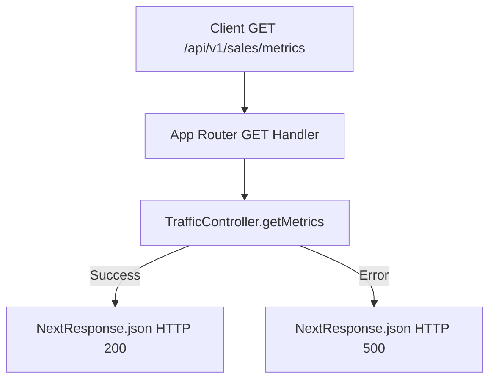

# Design - api_traffic_metrics_route (Feature ID: 12)

## Affected Files
- [NEW] `src/app/api/v1/sales/metrics/route.ts`: Exposes the HTTP GET App Router endpoint.
- [NEW] `tests/integration/api_traffic_metrics_route.test.ts`: Integration tests to verify controller delegation and HTTP status/header mapping.

## Architecture & Data Flow
Following Next.js App Router conventions and the established pasamanos pattern from F5 (`api_sales_record_route`):

- Incoming `GET` requests to `/api/v1/sales/metrics` are processed by the handler.
- No request body parsing is required (GET method).
- The handler delegates directly to `TrafficController.getMetrics`.
- The controller response determines the `NextResponse.json` payload and status code.

## Decisions & Alternatives
- **No Body Parsing**: Unlike F5 (POST), this is a GET route with no request body. The handler calls `TrafficController.getMetrics()` directly with no arguments, keeping the pasamanos layer as thin as possible.
- **Status Delegation**: Success returns **200 OK**. Failure status codes are extracted directly from the controller's returned packet (`result.status || 500`) matching the F5 pattern.
- **Error Handling**: No try-catch is needed at the route level for JSON parsing since there is no request body. The controller already handles its own errors internally and returns structured error packets.

## Next.js Guides Consulted
- Route Handlers: `node_modules/next/dist/docs/01-app/01-getting-started/15-route-handlers.md` — confirms GET handler export convention and `NextResponse.json` usage.
- Project Structure: `node_modules/next/dist/docs/01-app/01-getting-started/02-project-structure.md` — confirms `route.ts` file placement.

## Rejected Alternatives
- **Alternative 1: Add query parameter parsing for date range filters**: Rejected because the current feature acceptance criteria and F11 controller interface (`getMetrics()` with no parameters) do not require filtering. Adding query params would over-engineer the pasamanos beyond its current scope.
- **Alternative 2: Use `Response.json()` instead of `NextResponse.json()`**: Rejected to maintain consistency with the existing F5 route implementation and the project convention of using `NextResponse` from `next/server`.
