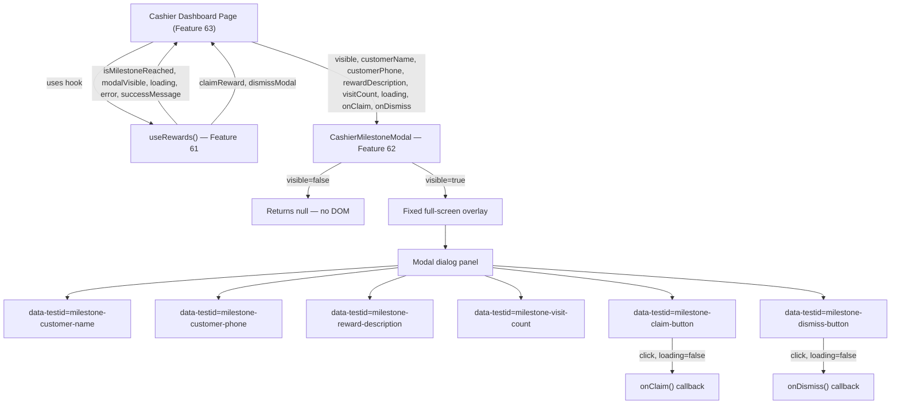

# Design - component_cashier_milestone_modal (Feature ID: 62)

## Affected Files

- **[NEW]** `src/components/cashier/milestone-modal.component.tsx` — Client UI component rendering the milestone reward modal overlay.
- **[NEW]** `tests/e2e/component_cashier_milestone_modal.spec.ts` — Playwright E2E tests verifying all modal states on a dedicated test route.

No backend files, API routes, hooks, or configurations are created or modified by this feature. This component is a pure, props-driven UI layer.

## Public Interface

```typescript
export interface CashierMilestoneModalProps {
  visible: boolean;
  customerName: string;
  customerPhone: string;
  rewardDescription: string;
  visitCount: number;
  loading: boolean;
  onClaim: () => void;
  onDismiss: () => void;
}

export function CashierMilestoneModal(props: CashierMilestoneModalProps): JSX.Element | null;
```

All props are required. There are no optional props with default values — the parent component (the cashier page, Feature 63) owns all state via the `useRewards` hook (Feature 61) and passes explicit values down.

## Architecture & Data Flow



### Props Contract

| Prop | Type | Purpose |
|---|---|---|
| `visible` | `boolean` | Controls whether the modal is rendered in the DOM. When `false`, component returns `null`. |
| `customerName` | `string` | Customer display name shown in the reward header. |
| `customerPhone` | `string` | Masked or standard phone shown below the name. |
| `rewardDescription` | `string` | Human-readable reward detail (e.g., "Free coffee on your next visit"). |
| `visitCount` | `number` | The milestone visit count number (typically 10) displayed for context. |
| `loading` | `boolean` | When `true`, both buttons are disabled and the claim button renders a spinner. |
| `onClaim` | `() => void` | Callback fired when the cashier confirms the reward claim. |
| `onDismiss` | `() => void` | Callback fired when the cashier dismisses the modal without claiming. |

### Conditional Render Strategy

The component uses a short-circuit `if (!visible) return null;` guard at the top of the function body, before any JSX. This avoids rendering a hidden overlay element to the DOM when the modal is inactive, keeping the DOM clean for accessibility tools and Playwright selectors.

### Overlay & Panel Layout

- **Overlay** (`data-testid="milestone-modal-overlay"`): `position: fixed`, `inset: 0`, semi-transparent dark backdrop using Tailwind `bg-black/70`. Placed above all other content using a high `z-index` (Tailwind `z-50`).
- **Panel** (`data-testid="milestone-modal-panel"`): Centered card using `flex`, `items-center`, `justify-center` on the overlay. The panel itself uses `bg-zinc-900`, `border border-zinc-700`, `rounded-2xl`, `p-8`, and `max-w-sm w-full` to match existing cashier form aesthetics.
- **Typography**: Customer name uses a large, bold heading; reward description uses normal weight body text. Consistent with `text-zinc-100` / `text-zinc-400` color scheme from `form.component.tsx`.

### Button Behavior

- **Claim button** (`data-testid="milestone-claim-button"`): Uses `bg-indigo-600 hover:bg-indigo-500` consistent with existing cashier submit button. When `loading`, renders an inline SVG spinner (same SVG as `form.component.tsx`) and has `disabled` attribute.
- **Dismiss button** (`data-testid="milestone-dismiss-button"`): Uses a secondary style (`border border-zinc-600 text-zinc-300 hover:bg-zinc-800`) to visually differentiate from the primary action. Also `disabled` when `loading`.

## Implementation Decisions

- **Client Component**: Must use `"use client"` directive. The component responds to boolean prop changes (`visible`, `loading`) and renders interactive buttons with `onClick` handlers. These require client-side rendering as confirmed by the Next.js Server and Client Components guide (`node_modules/next/dist/docs/01-app/01-getting-started/05-server-and-client-components.md`).
- **No internal state**: The component holds zero local `useState`. All state is owned by the parent page via `useRewards`. This keeps the component purely presentational and trivially testable.
- **Return `null` over CSS `hidden`**: Hiding with CSS (e.g., `display: none` or `invisible`) would leave DOM nodes present, breaking E2E test assertions that check for element absence. Returning `null` is the correct React pattern.
- **Max 150 lines**: Per `docs/conventions.md`, no component file may exceed 150 lines. The modal is simple enough (no internal hooks, no sub-components) to remain well under this limit.
- **No sub-component extraction needed**: The panel content is flat and non-repetitive; no extraction into atomic sub-components is warranted.
- **Tailwind only**: Styling uses only existing Tailwind utilities (already configured in the project). No new CSS files or custom Tailwind config changes needed.

## Testing Strategy

The E2E test file `tests/e2e/component_cashier_milestone_modal.spec.ts` will use a dedicated test route that mounts the component with controlled props. This mirrors the pattern from `component_manager_arrivals_feed` (Feature 56), which uses a `/test/arrivals-feed` route. The implementer must create a corresponding test-only route page (e.g., `/test/milestone-modal/page.tsx`) to host the component during E2E testing.

The test suite covers:

1. **Hidden state**: Navigate to test route with `visible=false`; assert `data-testid="milestone-modal-overlay"` is not in DOM.
2. **Visible state**: Navigate with `visible=true`; assert overlay present, all four data fields render correct prop values.
3. **Claim interaction**: Assert clicking claim button fires `onClaim` (via spy/mock callback tracked by test state).
4. **Dismiss interaction**: Assert clicking dismiss button fires `onDismiss`.
5. **Loading state**: Assert both buttons have the `disabled` attribute when `loading=true`.

## Next.js Docs Consulted

- `node_modules/next/dist/docs/01-app/01-getting-started/05-server-and-client-components.md` — Confirmed the component must use `"use client"` because it uses interactive `onClick` event handlers. Server Components cannot process event handler props.

## Rejected Alternatives

- **Render a hidden overlay with `opacity-0 pointer-events-none`**: Rejected. DOM presence when invisible breaks Playwright assertions that check element absence (`.not.toBeVisible()` passes but `.not.toBeInTheDocument()` would fail). The `return null` pattern is cleaner and maps directly to R2.
- **Use a `<dialog>` HTML element with `showModal()` / `close()` imperative API**: Rejected. The project uses declarative React state, not imperative DOM APIs. The `<dialog>` approach would require a `useRef` + `useEffect` to call `.showModal()`, adding unnecessary complexity to what is a purely props-driven component.
- **Merge this component into `form.component.tsx`**: Rejected. Feature decomposition in the feature list treats each component as its own atomic unit. Merging would violate the Single Responsibility rule from `docs/conventions.md` and would push `form.component.tsx` well past the 150-line limit.
