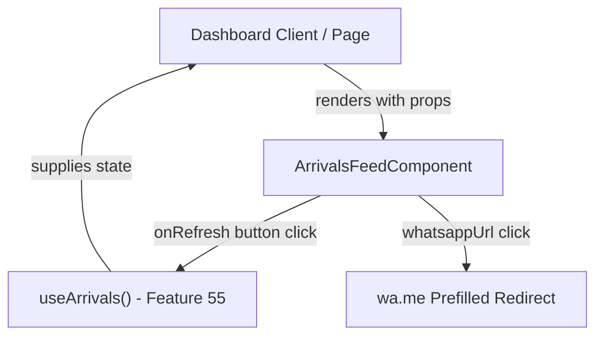

# Design - component_manager_arrivals_feed (Feature ID: 56)

Feature 56 adds the Arrivals Feed UI component, enabling managers to track active customer portal visits and fire pre-filled greeting messages via WhatsApp in real-time.

## Affected Files

| Type | Path | Purpose |
| --- | --- | --- |
| New | `src/components/dashboard/arrivals-feed.component.tsx` | Pure presentations dashboard panel containing summary metrics, state views (skeleton, error, empty), and a listing of live customer cards with direct-to-WhatsApp greeting actions. |
| New | `src/app/test/arrivals-feed/page.tsx` | A test-only route mapping mock scenarios (loading, empty, error, active notifications) to allow Playwright structure and flow assertions. |
| New | `tests/e2e/component_manager_arrivals_feed.spec.ts` | E2E browser tests checking component rendering, layout adaptations, error banners, and action link click properties. |

## Public Interface

```typescript
import type {
  ArrivalNotificationWithMeta,
  ArrivalNotificationsSummary,
} from "@/backend/types/models.type";

export interface ArrivalsFeedProps {
  notifications: ArrivalNotificationWithMeta[];
  summary: ArrivalNotificationsSummary | null;
  loading: boolean;
  error: string | null;
  onRefresh: () => void;
}
```

Exposed as a default or named export `ArrivalsFeedComponent` from `src/components/dashboard/arrivals-feed.component.tsx`.

## Architecture and Data Flow

The component sits at the presentation layer, entirely decoupled from model structures and controller routes. It expects raw state variables and simple callbacks, which makes it 100% testable in isolation using both Playwright test-routes and unit mocks.



## Implementation Decisions

- **Tailwind UI/UX Theme:** Align container aesthetics with `segment-cards.component.tsx` and `predictive-card.component.tsx` using `rounded-2xl bg-zinc-900/60 border border-zinc-800/80 p-6 backdrop-blur-md shadow-lg`.
- **Skeleton Renders:** Use `.animate-pulse` with matching zinc blocks to represent loading states without screen jitter.
- **Error States:** Informative crimson warning panels (`bg-red-500/10 border-red-500/30 text-red-400`) alongside interactive `Retry` triggers.
- **WhatsApp Color Scheme:** Green highlights (`bg-emerald-600 hover:bg-emerald-700 text-zinc-100`) matching standard branding to indicate messaging actions.
- **Relative/Absolute Time String:** Render neat time formatting (using native JS `toLocaleTimeString` or standard relative helpers) to represent client arrival times without requiring external date libraries.

## Testing Strategy

Playwright E2E browser tests in `tests/e2e/component_manager_arrivals_feed.spec.ts` will navigate to the test-only route `/test/arrivals-feed`. The tests will cover:

1. **R2:** Asserting `.animate-pulse` and skeleton cards are visible during simulated loading scenarios.
2. **R3:** Asserting error displays and checking if the `onRefresh` prop is triggered upon clicking the `Retry` button.
3. **R4:** Asserting empty state visibility and wording when zero notifications exist.
4. **R5:** Asserting the presence of the dashboard stats (Total, Named, Anonymous counts) and verifying every feed item:
   - Contains a name, or fallback label "Cliente Anónimo".
   - Shows standard phone string.
   - Shows the formatted time.
   - Displays the greeting text preview.
   - Embeds a WhatsApp CTA link with correct `href`, `target="_blank"`, and security properties `rel="noopener noreferrer"`.
5. **R6:** Asserting click verification of the manual reload button in the panel header.

## Consulted local Next.js Docs

- `node_modules/next/dist/docs/01-app/01-getting-started/05-server-and-client-components.md`: Since this component is interactive (uses event handlers for callbacks), it must be a client-side component starting with the `"use client"` directive.

## Rejected Alternatives

| Alternative | Decision | Reason |
| --- | --- | --- |
| Call `useArrivals()` internally inside `ArrivalsFeedComponent` | Rejected | Coupling the hook directly blocks the ability to test different states (loading, empty, error) easily via standard props. Passing properties makes the component a pure visual function, adhering to clean presentation guidelines. |
| Mask the entire phone number to `***` | Rejected | Managers need to see the client's phone number to verify identity or troubleshoot communication. Showing the standard phone format returned by the controller is more practical for cashiers and managers. |
