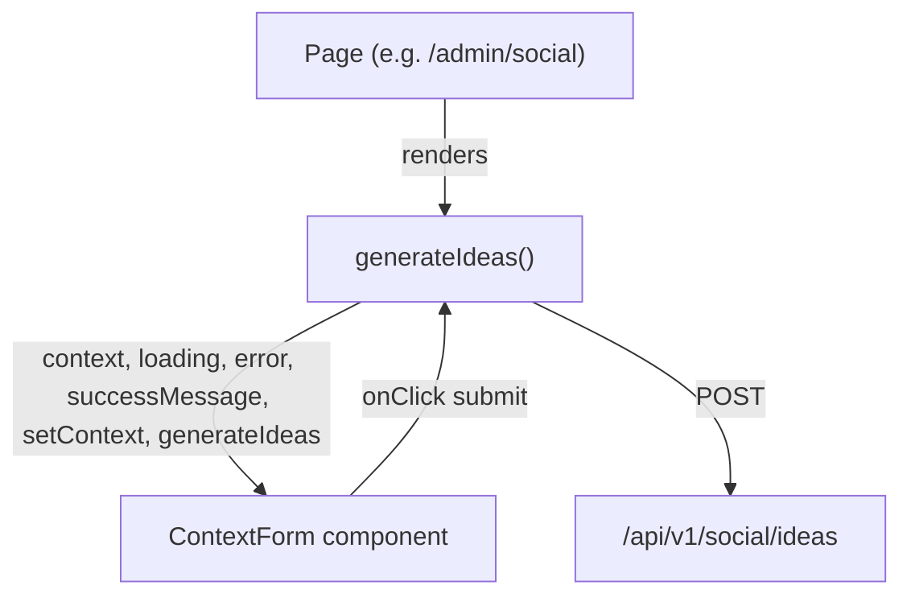

# Design: Social Context Form Input UI Component

## File Location

`src/components/social/context-form.component.tsx`

## Affected Files

- [NEW] `src/components/social/context-form.component.tsx` — Main UI component with responsive textarea, char count, and submit trigger.
- [NEW] `src/app/test/context-form/page.tsx` — E2E test harness page with mock hook states.
- [NEW] `tests/e2e/component_social_context_form.e2e.test.ts` — Playwright E2E tests.

## Architecture

### Component Type

Client Component (`"use client"`). The component is a presentational UI unit that receives data and callbacks from its parent. It does not perform data fetching or side effects directly.

### Props Interface

```typescript
export interface ContextFormProps {
  context: string;
  loading: boolean;
  error: string | null;
  successMessage: string | null;
  setContext: (value: string) => void;
  onSubmit: () => void;
}
```

Export `ContextForm(props: ContextFormProps): JSX.Element`.

### States

The component handles four visual states:

1. **Idle / Input** (default): Textarea with character count, submit button enabled.
2. **Loading** (`loading === true`): Submit button disabled with inline SVG spinner; textarea remains editable so user can keep typing.
3. **Error** (`error !== null`): Red-tinted inline banner above textarea with error message text and `role="alert"`.
4. **Success** (`successMessage !== null`): Green-tinted inline banner above textarea with success confirmation and `role="status"`; textarea reflects cleared state.

### Data Flow



The parent page calls `useSocialIdeas()` and passes the return values directly as props to `ContextForm`. The submit button triggers `generateIdeas()`. The textarea value is bound to `context` via `setContext`.

### Visual Design

#### Form Container

Standard card container consistent with existing patterns:
```tsx
rounded-2xl bg-zinc-900/60 border border-zinc-800/80 p-6 backdrop-blur-md shadow-lg
```

Max-width wrapper: `w-full max-w-lg mx-auto` to center on desktop while filling mobile viewports.

#### Textarea Input

```tsx
<textarea
  id="social-context"
  name="context"
  rows={6}                  // mobile default; responsive via CSS or class
  aria-label="Describe your social post idea"
  placeholder="e.g. Weekend special offer for our regular customers..."
  value={context}
  onChange={(e) => setContext(e.target.value)}
  className="w-full rounded-lg border border-zinc-700 bg-zinc-950 px-4 py-3 text-zinc-100 focus:border-indigo-500 focus:outline-none focus:ring-1 focus:ring-indigo-500 resize-vertical min-h-[120px]"
  data-testid="context-textarea"
/>
```

- `rows={6}` for mobile; responsive class `sm:rows-4` for desktop (≥640px)
- `resize-vertical` to let user enlarge on desktop
- `min-h-[120px]` ensures adequate touch target for initial tap

#### Character Count

Displayed below textarea:
```tsx
<div className="flex justify-between text-xs text-zinc-500">
  <span>{context.length} / 3 min</span>
  {context.length > 0 && context.length < 3 && (
    <span className="text-amber-400">Minimum 3 characters required</span>
  )}
</div>
```

- Shows current length vs minimum requirement
- Warning color when length is between 1 and 2 (below minimum)

#### Submit Button

```tsx
<button
  type="button"
  onClick={onSubmit}
  disabled={loading}
  className="w-full rounded-xl bg-indigo-600 px-4 py-3 font-semibold text-white hover:bg-indigo-500 disabled:cursor-not-allowed disabled:opacity-60 transition-colors min-h-11"
  data-testid="context-submit"
>
  {loading && (
    <svg className="h-5 w-5 animate-spin text-white inline mr-2" ...>...</svg>
  )}
  Generate Ideas
</button>
```

- `py-3` + `min-h-11` ensures ≥44px touch target (R7)
- `w-full` fills card width on all viewports
- Loading spinner matches existing `CashierForm` pattern (SVG inline spinner)

#### Error Banner

```tsx
{error && (
  <div role="alert" data-testid="context-error" className="rounded-xl bg-red-900/30 border border-red-700/50 px-4 py-3 text-sm text-red-300 flex items-center gap-2">
    <span className="w-2 h-2 rounded-full bg-red-500" />
    {error}
  </div>
)}
```

#### Success Banner

```tsx
{successMessage && (
  <div role="status" data-testid="context-success" className="rounded-xl bg-emerald-900/30 border border-emerald-700/50 px-4 py-3 text-sm text-emerald-300 flex items-center gap-2">
    <span className="w-2 h-2 rounded-full bg-emerald-500" />
    {successMessage}
  </div>
)}
```

### Responsive Behavior

- **Mobile** (≤640px): `rows={6}`, full-width card, no horizontal overflow
- **Desktop** (>640px): `sm:rows={4}`, centered via `max-w-lg mx-auto`
- Touch targets: button uses `py-3` (≥44px height)
- All content scrolls vertically if needed; no horizontal scroll at any breakpoint

### Error Handling

- **error**: Displayed as an inline banner within the component (not a toast or modal). User can correct input and retry.
- **successMessage**: Displayed as an inline success banner. Automatically cleared by the hook after display.
- **Validation**: Minimum 3 character check is handled by the backend controller (SocialController `handleSocialIdeas`), not duplicated in the component. The component shows the char count as guidance.

### Next.js Docs Consulted

- `node_modules/next/dist/docs/01-app/01-getting-started/05-server-and-client-components.md` — Client component directive usage.
- `node_modules/next/dist/docs/01-app/01-getting-started/02-project-structure.md` — Project structure conventions.

### Rejected Alternatives

- **Server Component**: Rejected. The component handles click/tap events, `useEffect`-free but still needs `"use client"` for interactive state management via props.
- **Inline data fetching inside the component**: Rejected. The component accepts data as props, following the same pattern as `SegmentCards` (F27), `TrafficChartComponent` (F14), and `PredictiveCardComponent` (F18). This keeps it testable and decoupled from the data layer.
- **Single input element instead of textarea**: Rejected. The feature description says "textarea form" optimized for mobile. Context descriptions may be multi-sentence, requiring multiline input.
- **Client-side validation blocking submit**: Rejected. The backend controller already validates min 3 chars. The component shows char count as guidance but does not block submission — the error banner will surface the controller's validation error naturally.
- **Use toast for success/error messages**: Rejected. Inline banners (matching `segment-cards.component.tsx` and `traffic/chart.component.tsx` patterns) are more accessible and predictable on mobile viewports.
