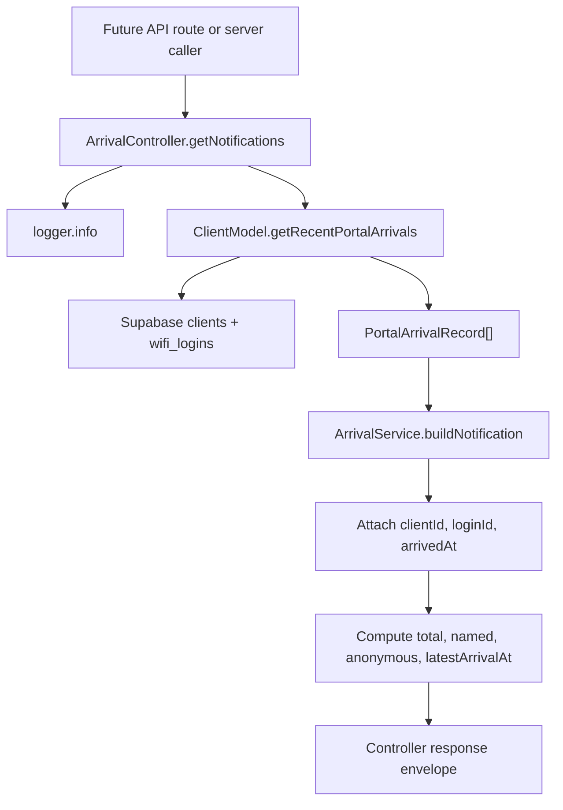

# Design - controller_arrival_notifications (Feature ID: 53)

## Overview

`controller_arrival_notifications` adds the backend controller surface that future route and UI features will consume for manager-visible arrival alerts. It stays inside the decoupled backend layer: the controller coordinates model reads and service formatting, the model owns Supabase access, and the existing `ArrivalService` owns greeting and WhatsApp URL generation.

## Affected Files

| Action | File | Reason |
| --- | --- | --- |
| New | `src/backend/controllers/arrival.controller.ts` | Add `ArrivalController.getNotifications()` as the HTTP-independent controller action. |
| Update | `src/backend/models/client.model.ts` | Add a narrowly scoped `getRecentPortalArrivals()` model method because no existing model read returns joined `wifi_logins` + `clients` arrival rows. |
| Update | `src/backend/types/models.type.ts` | Add shared arrival record, enriched notification, summary, and controller response interfaces. |
| New | `tests/integration/controller_arrival_notifications.integration.test.ts` | Verify the controller response, summary metrics, service delegation, and error mapping. |

## Public Interfaces

```typescript
export interface PortalArrivalRecord {
  clientId: string;
  loginId: string;
  phone_number: string;
  name: string | null;
  arrivedAt: string;
}

export interface ArrivalNotificationWithMeta extends ArrivalNotification {
  clientId: string;
  loginId: string;
  arrivedAt: string;
}

export interface ArrivalNotificationsSummary {
  total: number;
  named: number;
  anonymous: number;
  generatedAt: string;
  latestArrivalAt: string | null;
}

export interface ArrivalNotificationsResult {
  notifications: ArrivalNotificationWithMeta[];
  summary: ArrivalNotificationsSummary;
}

export type ArrivalControllerResponse =
  | { success: true; data: ArrivalNotificationsResult }
  | { success: false; status: number; error: string };

export class ClientModel {
  static getRecentPortalArrivals(limit?: number): Promise<PortalArrivalRecord[]>;
}

export class ArrivalController {
  static getNotifications(): Promise<ArrivalControllerResponse>;
}
```

## Data Flow



## Behavior

- `ArrivalController.getNotifications()` accepts no parameters in this feature. The model method may use a default limit of 10 recent arrivals to keep the future manager feed bounded.
- The controller logs start and error events with the existing `logger`.
- `ClientModel.getRecentPortalArrivals(limit = 10)` returns rows ordered by newest `wifi_logins.created_at`.
- In offline simulation mode, the model returns deterministic mock rows through `supabaseModel.executeQuery`, following existing model patterns.
- In Supabase mode, the model queries `wifi_logins`, selects `id`, `created_at`, and joined `clients(id, phone_number, name)`, then maps rows into `PortalArrivalRecord`.
- Each row is transformed through `ArrivalService.buildNotification({ phone_number, name })`.
- The controller returns enriched notifications by spreading the service output and adding `clientId`, `loginId`, and `arrivedAt`.
- `summary.named` counts notifications whose normalized `name` is non-empty.
- `summary.anonymous` equals `total - named`.
- `summary.latestArrivalAt` is the first notification `arrivedAt` after newest-first ordering, or `null` when there are no rows.
- `summary.generatedAt` is an ISO timestamp created when the response is built.

## Error Handling

- `DB_CONNECTION_FAILURE` from the model maps to `{ success: false, status: 500, error: "DB_CONNECTION_FAILURE" }`.
- Any other thrown error maps to `{ success: false, status: 500, error: err.message || "Failed to get arrival notifications" }`.
- All caught errors are logged with `logger.error` before returning.
- Empty model results are valid and return `{ notifications: [], summary: { total: 0, named: 0, anonymous: 0, generatedAt, latestArrivalAt: null } }`.

## Testing Strategy

Use Vitest integration tests with spies on `ClientModel.getRecentPortalArrivals`, `ArrivalService.buildNotification`, and `logger` where useful:

- Successful response with mixed named and anonymous arrivals.
- Exact delegation from controller rows into `ArrivalService.buildNotification`.
- Enriched notification metadata preservation.
- Summary metrics, including `latestArrivalAt`.
- Empty-state response with zeroed counts.
- `DB_CONNECTION_FAILURE` response mapping.
- Generic error response mapping and error logging.

## Decisions and Alternatives

| Decision | Chosen approach | Alternative considered | Rationale |
| --- | --- | --- | --- |
| Controller shape | Static `ArrivalController.getNotifications()` method | Free function export | Existing controllers use static methods on classes for domain controller actions. |
| Model read helper | Add `ClientModel.getRecentPortalArrivals()` | Query Supabase directly inside the controller | Direct database access from controllers would break the model boundary defined in `docs/architecture.md`. |
| Formatting | Delegate all greeting and WhatsApp URL construction to `ArrivalService` | Rebuild greeting text in the controller | Feature 52 owns notification formatting, so reuse keeps this controller focused on orchestration. |
| Parameters | No controller parameters | Accept filter or limit parameters now | The feature acceptance describes active arrival alert output, and API query parsing belongs to the future route feature if needed. |

## Next.js Docs Consulted

- `node_modules/next/dist/docs/01-app/01-getting-started/15-route-handlers.md`
- `node_modules/next/dist/docs/01-app/03-api-reference/03-file-conventions/route.md`

These docs confirm that the future route feature should remain a thin App Router `route.ts` handler using Web `Request`/`Response` APIs. This feature therefore keeps framework-specific request parsing out of the controller.
