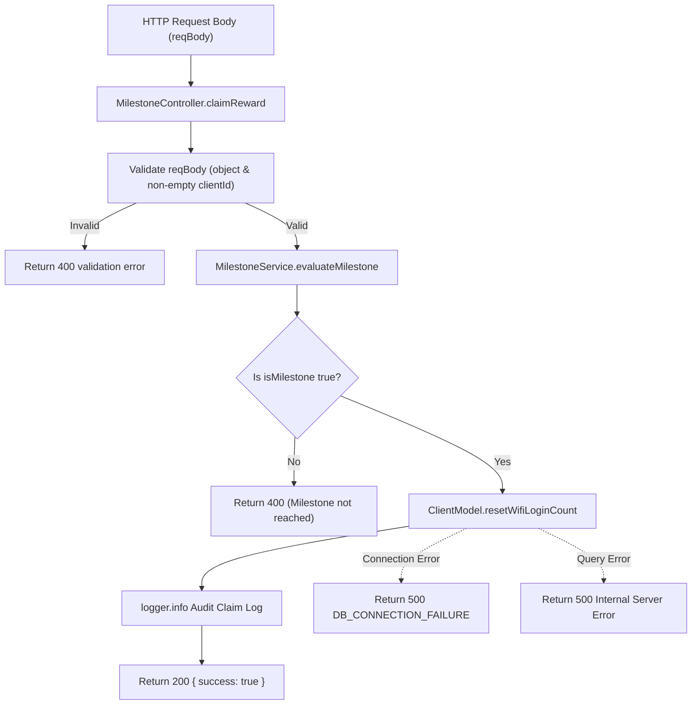

# Design — controller_reward_claim (Feature ID: 59)

## Affected Files

- `src/backend/models/client.model.ts` — Add the `resetWifiLoginCount(clientId: string): Promise<void>` method.
- `src/backend/controllers/milestone.controller.ts` — Implement the `MilestoneController.claimReward(reqBody: unknown)` method.
- `tests/integration/controller_reward_claim.test.ts` — Create the integration tests verifying validation, successful claims, and database error states.

---

## Architecture

This feature belongs to the decoupled backend layer. It introduces a brand new HTTP coordinator (`MilestoneController`) which receives request payloads, validates input fields, coordinates milestone service evaluations, updates client visit counts via database model methods, logs audit actions, and yields standard JSON responses. This controller is completely isolated from Next.js server-side structures and client rendering components.



---

## Public Interfaces

### Model Layer Extensions (`src/backend/models/client.model.ts`)

```typescript
export class ClientModel {
  /**
   * Resets the visit counter for a specific client by deleting their records in the wifi_logins table.
   * In offline simulation mode, returns successfully.
   * Throws DB_CONNECTION_FAILURE or DB_QUERY_ERROR on database failure.
   */
  static async resetWifiLoginCount(clientId: string): Promise<void>;
}
```

### Controller Layer Implementations (`src/backend/controllers/milestone.controller.ts`)

```typescript
export interface ControllerResponse {
  success: boolean;
  status?: number;
  data?: any;
  error?: string;
}

export class MilestoneController {
  /**
   * Evaluates eligibility and performs a milestone claim.
   * Resets visit counts, logs claim audit information, and handles exception mappings.
   */
  static async claimReward(reqBody: unknown): Promise<ControllerResponse>;
}
```

---

## Behavior

1. **Request Verification:**
   - The controller checks if `reqBody` is a valid, non-null object. If not, it returns `{ success: false, status: 400, error: "Request body is required" }`.
   - The controller extracts the client ID (supporting both camelCase `clientId` and snake_case `client_id`). If the extracted ID is not a string, or contains only whitespace characters, it returns `{ success: false, status: 400, error: "Validation failed: Client ID is required" }`.

2. **Milestone Evaluation:**
   - The controller invokes `MilestoneService.evaluateMilestone(clientId)`.
   - If the service throws `INVALID_CLIENT_ID`, the controller yields a 400 error.
   - If the returned `isMilestone` is `false`, the controller returns `{ success: false, status: 400, error: "Validation failed: Milestone not reached" }`.

3. **Resetting Visit Counter:**
   - Once qualified, the controller deletes all login entries for this client by invoking `ClientModel.resetWifiLoginCount(clientId)`.
   - **Production Mode:** Queries Supabase to delete all matching logins:
     ```typescript
     const client = supabaseModel.getClient();
     const { error } = await client
       .from("wifi_logins")
       .delete()
       .eq("client_id", clientId);
     ```
   - **Offline Simulation Mode:** Invokes `supabaseModel.executeQuery` to mock deletion latency.

4. **Auditing and Return Packets:**
   - Upon successful database execution, the controller writes a descriptive audit statement:
     ```typescript
     logger.info("Reward claimed successfully", { clientId, claimedAt: new Date().toISOString() });
     ```
   - Returns `{ success: true, status: 200, data: { message: "Reward claimed successfully" } }` (or similar success shape).

---

## Error Handling

- **Invalid Client Errors:** Propagates explicit `INVALID_CLIENT_ID` or validation messages with status `400`.
- **Database Connection Failure:** If `resetWifiLoginCount` throws an exception containing connection failure indicators, the controller returns status `500` with the error `DB_CONNECTION_FAILURE`.
- **General Database Errors:** Other exceptions trigger a generic status `500` return stating `Internal Server Error`.

---

## Decisions & Alternatives

| Decision | Chosen approach | Alternative considered | Rationale |
| --- | --- | --- | --- |
| **Visit Reset Method** | Deleting client records from `wifi_logins`. | Adding a `claimed` column or creating a `reward_claims` schema table. | Deleting the client's `wifi_logins` records resets their visit count cleanly to 0. It avoids database schema changes, keeps queries simple, and allows milestone cycles to repeat naturally without modifying the core database types. |
| **Controller Parameter Parsing** | Extracting both `clientId` and `client_id`. | Strictly requiring one specific casing pattern. | Accepting both casings prevents compatibility issues between frontend camelCase calls and backend snake_case formats, making the API more robust and easier to integrate. |

---

## Next.js Docs Consulted

No Next.js guides are required for this purely backend controller and model addition because it resides within the isolated `src/backend/` space and has no interaction with pages, layouts, custom hooks, or frontend components.
