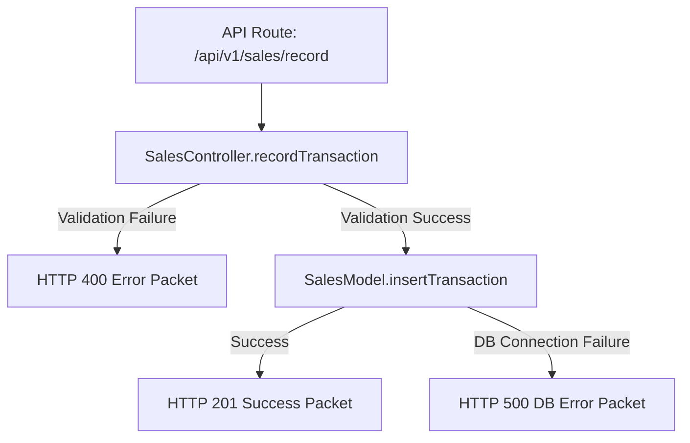

# Design - controller_sales_record (Feature ID: 4)

## Affected Files
- [NEW] [sales.controller.ts](file:///Users/juarpla/Documents/Code%20Practice/loyalty/src/backend/controllers/sales.controller.ts): Implements the sales transaction registration HTTP controller logic.
- [NEW] [controller-sales-record.integration.test.ts](file:///Users/juarpla/Documents/Code%20Practice/loyalty/tests/integration/controller-sales-record.integration.test.ts): Integration tests to verify validation rules and successful database delegation.

## Architecture & Data Flow
Following Decoupled MVC, API routes receive the raw request body and delegate to `SalesController.recordTransaction`. The controller parses the parameters, sanitizes inputs, performs schema validation, and maps to the database operations layer.

## Decisions & Alternatives
- **Decoupled Controller Input**: The controller method `recordTransaction` takes a plain payload object containing `phone_number` (or `phoneNumber`) and `amount` of type `any`, ensuring total decoupling from Next.js server runtime components.
- **Phone Validation Regular Expression**: We will use a regular expression to validate E.164 phone formats. The pattern `^(\+51\d{9}|\+\d{7,15})$` will accept either a Peruvian number with the `+51` prefix followed by 9 digits, or a general international E.164 standard phone format (`+` followed by 7-15 digits).
- **Amount Validation**: The controller will convert the `amount` parameter to a `Number` and assert `isNaN(amount) || amount <= 0` to ensure it is strictly positive.
- **Database Connection Error Catching**: Standard database errors will be captured and standard codes like `'DB_CONNECTION_FAILURE'` will be mapped cleanly to HTTP status 500.
