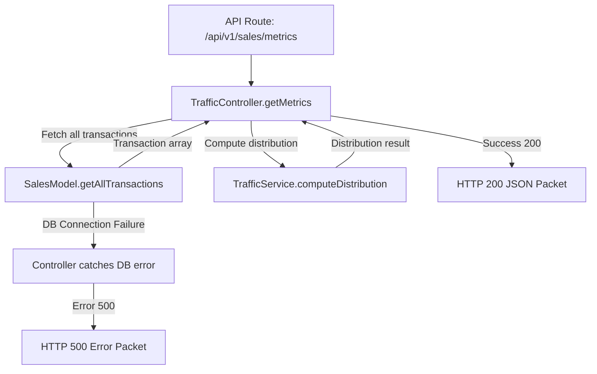

# Design - controller_traffic_metrics (Feature ID: 11)

## Affected Files
- [NEW] [traffic.controller.ts](file:///Users/juarpla/Documents/Code%20Practice/loyalty/src/backend/controllers/traffic.controller.ts): Implements the traffic metrics HTTP controller logic.
- [NEW] [controller_traffic_metrics.test.ts](file:///Users/juarpla/Documents/Code%20Practice/loyalty/tests/integration/controller_traffic_metrics.test.ts): Integration tests to verify payload layouts and status codes.

## Architecture & Data Flow
Following the established decoupled MVC pattern, the API route receives the HTTP request and delegates to `TrafficController.getMetrics`. The controller fetches transaction records from the model layer, invokes the `TrafficService.computeDistribution` pure function, and maps the result to a clean JSON response packet.

## Decisions & Alternatives
- **Decoupled Controller Input**: The controller method `getMetrics` takes no parameters (or optional date range filters), ensuring total decoupling from Next.js server runtime components.
- **Transaction Fetching Strategy**: The controller delegates data retrieval to a `SalesModel.getAllTransactions` method (to be implemented). This keeps the controller thin and testable.
- **Service Invocation**: The controller passes the fetched transaction array directly to `TrafficService.computeDistribution`, which is a pure function with no side effects.
- **Error Mapping**: Database connection failures are mapped to `DB_CONNECTION_FAILURE` code; all other errors return a descriptive message from the exception.

## Next.js Guides Consulted
- App Router API Routes: `node_modules/next/dist/docs/01-app/01-getting-started/03-layouts-and-pages.md`
- Server and Client Components: `node_modules/next/dist/docs/01-app/01-getting-started/05-server-and-client-components.md`

## Rejected Alternatives
- **Alternative 1: Controller fetches data directly**: Rejected because it would mix HTTP coordination logic with database access, violating the decoupled MVC principle used throughout this project.
- **Alternative 2: TrafficService fetches its own data**: Rejected because the service is designed as a pure computation unit (per feature 10 spec), and introducing database dependencies would break testability.