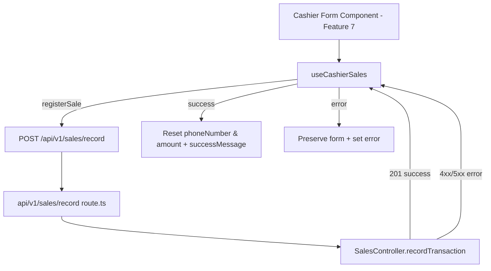

# Design - hook_cashier_sales (Feature ID: 6)

## Affected Files

- [NEW] `src/hooks/use-cashier-sales.hook.ts` — Client hook orchestrating cashier form state, loading flags, and sales registration fetch.
- [NEW] `tests/integration/hook-cashier-sales.integration.test.ts` — Vitest integration tests for loading toggles, fetch payload, success resets, and error preservation.
- [UPDATE] `package.json` / `pnpm-lock.yaml` — Add `@testing-library/react` dev dependency if not already present (required for `renderHook`).

## Public Interface

```typescript
interface UseCashierSalesResult {
  phoneNumber: string;
  amount: string;
  loading: boolean;
  error: string | null;
  successMessage: string | null;
  setPhoneNumber: (value: string) => void;
  setAmount: (value: string) => void;
  registerSale: () => Promise<void>;
}
```

Export `useCashierSales(): UseCashierSalesResult` from `src/hooks/use-cashier-sales.hook.ts` with `"use client"` directive.

## Architecture & Data Flow

The hook follows the same frontend abstraction pattern as `use-traffic.hook.ts` and `use-wifi.hook.ts`: components remain presentational; all `fetch` orchestration lives in the hook.



### Request / Response Contract

Aligned with Feature 5 (`api_sales_record_route`):

- **Request**: `POST /api/v1/sales/record`, `Content-Type: application/json`, body `{ phone_number: string, amount: number }`.
- **Success**: HTTP `201`, body `{ success: true, data: SalesTransaction }`.
- **Failure**: HTTP `400` or `500`, body `{ success: false, status: number, error: string }`.

Use `SalesTransaction` from `@/backend/types/models.type` for typed success `data` only (type import is allowed; no model or controller imports).

## Implementation Decisions

- **String form fields**: `amount` is stored as `string` to support numeric keypad UI in Feature 7; conversion to `number` happens at fetch time via `Number(amount)`.
- **Success banner**: `successMessage` is a short fixed string (e.g. `"Sale registered successfully"`) set on success and cleared when a new `registerSale` starts.
- **No client-side phone regex**: Validation stays in `SalesController` (Feature 4); the hook surfaces API error messages.
- **Fetch target**: Hard-code `/api/v1/sales/record` (same pattern as `useTraffic` hard-coding `/api/traffic`).

## Testing Strategy

`vitest.config.mts` defaults to `environment: 'node'`. The hook test file MUST declare `// @vitest-environment jsdom` at the top so `renderHook` can run without changing global Vitest config.

Tests use `@testing-library/react` `renderHook` + `act` and mock `global.fetch`. This verifies hook state integration (loading toggles, form resets) without rendering cashier UI components — consistent with `docs/verification.md` (no Vitest component/page rendering; Playwright covers UI in Features 7–9).

## Next.js Docs Consulted

- `node_modules/next/dist/docs/01-app/02-guides/testing/index.md` — Hook testing category and tooling guidance.

## Rejected Alternatives

- **Import `SalesController` directly in the hook**: Rejected; violates layer isolation (`docs/conventions.md`). Hooks must call HTTP routes only.
- **Vitest `node` environment without React**: Rejected; cannot exercise `useState`/`useCallback` lifecycle without a minimal React test runtime.
- **Playwright for hook state**: Rejected for this feature; E2E is reserved for Features 7–9 per the feature queue.
