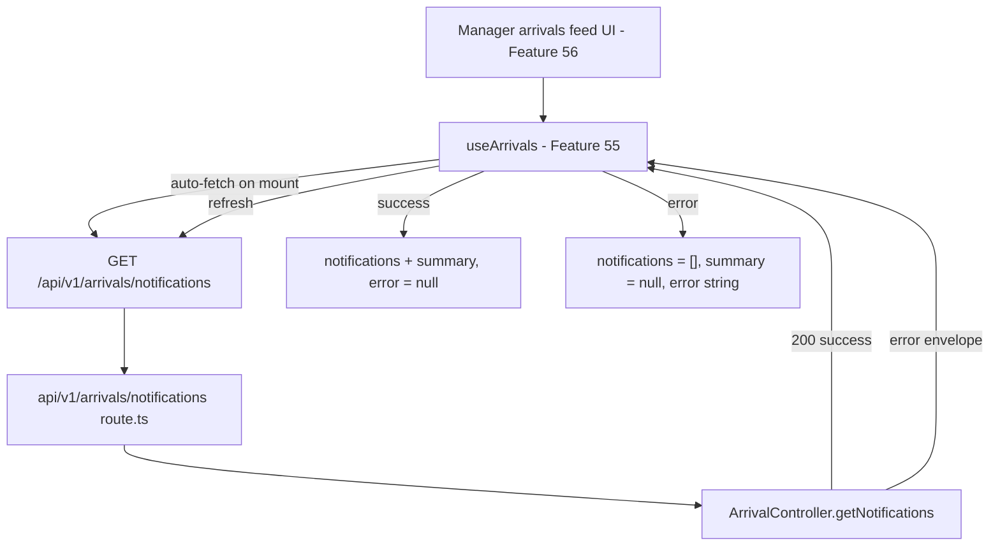

# Design - hook_manager_arrivals (Feature ID: 55)

## Affected Files

| Type | Path | Purpose |
| --- | --- | --- |
| New | `src/hooks/use-arrivals.hook.ts` | Add a client-side manager arrivals hook that fetches active arrival notifications and exposes UI-safe state. |
| New | `tests/integration/hook-manager-arrivals.integration.test.ts` | Add Vitest hook coverage for fetch lifecycle, success state, error state, and refresh behavior. |

## Public Interface

```typescript
import type {
  ArrivalNotificationWithMeta,
  ArrivalNotificationsSummary,
} from "@/backend/types/models.type";

interface UseArrivalsResult {
  notifications: ArrivalNotificationWithMeta[];
  summary: ArrivalNotificationsSummary | null;
  loading: boolean;
  error: string | null;
  refresh: () => Promise<void>;
}
```

Export `useArrivals(): UseArrivalsResult` from `src/hooks/use-arrivals.hook.ts` with the `"use client"` directive.

## Architecture and Data Flow

The hook follows the existing frontend abstraction pattern from `useTraffic()` and `useCampaigns()`: UI components consume simple state and callbacks, while all browser `fetch` orchestration stays inside the hook. It must not import `ArrivalController`, `ClientModel`, or `ArrivalService`.



## Request and Response Contract

Aligned with Feature 54 (`api_arrival_notifications_route`):

- **Request:** `GET /api/v1/arrivals/notifications`, no request body or query parameters.
- **Success:** HTTP `200`, body `{ success: true, data: ArrivalNotificationsResult }`.
- **Failure:** non-200 body `{ success: false, status?: number, error: string }`.

`ArrivalNotificationsResult` contains:

```typescript
interface ArrivalNotificationsResult {
  notifications: ArrivalNotificationWithMeta[];
  summary: ArrivalNotificationsSummary;
}
```

The hook imports these as type-only imports from `@/backend/types/models.type`, which is consistent with the existing hook pattern and does not cross into backend runtime dependencies.

## Implementation Decisions

- **Auto-fetch on mount:** Use `useEffect` with the existing `setTimeout(..., 0)` pattern from nearby hooks so tests can observe initial loading state before the request settles.
- **State shape:** Use `notifications: []` instead of `null` so the future feed component can map safely without defensive null checks.
- **Summary nullable:** Use `summary: null` before first success and after errors because there is no meaningful zero summary until the API provides one.
- **Manual refresh:** Expose `refresh` as the same `useCallback` fetch function used by the mount effect.
- **Error handling:** Surface API-provided error strings when available; use a generic `"An unexpected error occurred while loading arrival notifications"` message for thrown or unknown failures.
- **Data reset on errors:** Clear notifications and summary on controlled or thrown failures to avoid displaying stale arrival alerts after a failed refresh.

## Testing Strategy

`vitest.config.mts` defaults to `environment: 'node'`. The hook test file must declare `// @vitest-environment jsdom` so `renderHook` can exercise React hook lifecycle behavior.

Use `@testing-library/react` `renderHook`, `act`, and `waitFor`, mock `global.fetch`, and restore globals after each test.

Planned cases:

- R1: Initial return shape exposes empty notifications, `summary: null`, `loading: true`, `error: null`, and a `refresh` function.
- R2/R3: Mounting the hook calls `/api/v1/arrivals/notifications` and toggles loading until the request settles.
- R4: A successful response stores notifications and summary, clears error, and settles loading.
- R5: A non-200 response and a 200 success-false response store the backend error and clear data.
- R6: A rejected fetch stores the generic arrival error and clears data.
- R7: Calling `refresh()` triggers another request and updates state from the second payload.
- R8: The integration test file covers all requirements above.

## Next.js Docs Consulted

- `node_modules/next/dist/docs/01-app/01-getting-started/05-server-and-client-components.md` — Custom hooks require a Client Component boundary; the hook file must use `"use client"`.
- `node_modules/next/dist/docs/01-app/02-guides/testing/index.md` — Hook behavior belongs in unit/integration-style testing; browser user flows remain future E2E scope.

## Rejected Alternatives

| Alternative | Decision | Reason |
| --- | --- | --- |
| Import `ArrivalController.getNotifications()` directly in the hook | Rejected | Frontend hooks must communicate through local API routes and must not import backend controllers or models. |
| Use SWR or React Query | Rejected | Existing hooks use lightweight `useState`, `useEffect`, and `useCallback`; adding a state library would exceed the feature scope. |
| Keep stale notifications after refresh failure | Rejected | Arrival alerts are time-sensitive; showing stale arrivals after a failed refresh could mislead managers. |
