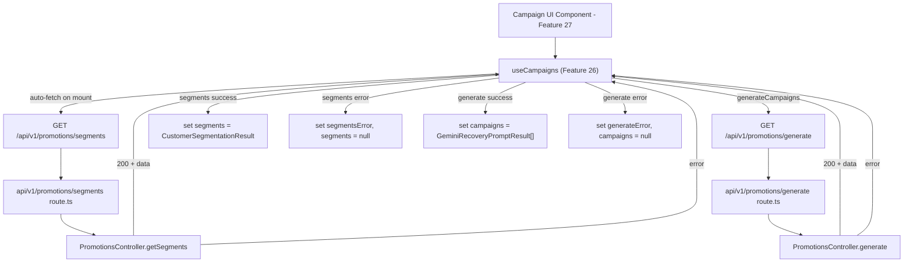

# Design - hook_manager_campaigns (Feature ID: 26)

## Affected Files

- [NEW] `src/hooks/use-campaigns.hook.ts` — Client hook orchestrating segments fetching, campaign generation, and loading/error states for the manager promotions UI.
- [NEW] `tests/integration/hook-manager-campaigns.integration.test.ts` — Vitest integration tests for segments auto-fetch, campaign generation lifecycle, and error handling.

## Public Interface

```typescript
import type {
  CustomerSegmentationResult,
  GeminiRecoveryPromptResult,
} from "@/backend/types/models.type";

interface UseCampaignsResult {
  // Segments state
  segments: CustomerSegmentationResult | null;
  segmentsLoading: boolean;
  segmentsError: string | null;

  // Campaign generation state
  campaigns: GeminiRecoveryPromptResult[] | null;
  generating: boolean;
  generateError: string | null;

  // Actions
  generateCampaigns: () => Promise<void>;
}
```

Export `useCampaigns(): UseCampaignsResult` from `src/hooks/use-campaigns.hook.ts` with `"use client"` directive.

## Architecture & Data Flow

The hook follows the same frontend abstraction pattern as `useTraffic` (F13) and `useCashierSales` (F6): components remain presentational; all `fetch` orchestration lives in the hook.



### Request / Response Contracts

**Segments endpoint** (aligned with F22 `api_promotions_segments_route`):
- **Request**: `GET /api/v1/promotions/segments`, no body or query params.
- **Success**: HTTP `200`, body `{ success: true, data: CustomerSegmentationResult }`.
- **Failure**: HTTP `500`, body `{ success: false, status: number, error: string }`.

**Generate endpoint** (aligned with F25 `api_promotions_generate_route`):
- **Request**: `GET /api/v1/promotions/generate`, no body or query params.
- **Success**: HTTP `200`, body `{ success: true, data: { campaigns: GeminiRecoveryPromptResult[] } }`.
- **Failure**: HTTP `500`, body `{ success: false, status: number, error: string }`.

### Type Imports

Import from `@/backend/types/models.type` (same pattern as `useTraffic`):
- `CustomerSegmentationResult` — full segments payload with `segments: SegmentedCustomer[]` and `summary`.
- `GeminiRecoveryPromptResult` — generation result with `phone_number`, `recoveryCopy`, `generatedAt`.

Type imports are allowed; no model or controller imports (convention `docs/conventions.md`).

## Implementation Decisions

- **Auto-fetch segments on mount**: Uses `useEffect` with `setTimeout(..., 0)` pattern (same as F13 `useTraffic`) to avoid synchronous setState during mount.
- **Separate loading states**: `segmentsLoading` (for segments fetch) and `generating` (for campaign generation) are independent — the user can view segments while generation runs asynchronously.
- **Previous data preserved during generation**: `segments` data persists in state when `generateCampaigns` is triggered; only `campaigns` and `generateError` are cleared on new generation.
- **No client-side validation**: The controller layer handles all business validation; the hook surfaces API error messages directly.
- **Caching**: `segments` persists in state between generations; only overwritten on successful re-fetch (which only happens on mount).

## Testing Strategy

`vitest.config.mts` defaults to `environment: 'node'`. The hook test file MUST declare `// @vitest-environment jsdom` at the top so `renderHook` can run without changing global Vitest config.

Tests use `@testing-library/react` `renderHook` + `act` and mock `global.fetch`. Cases:
- R2/R3: Segments auto-fetch on mount, `segmentsLoading` toggles true→false, `segments` populated.
- R4: Segments API error (non-200) sets `segmentsError`, clears `segments`.
- R5: Network throw sets generic `segmentsError`, clears `segments`.
- R6: `generateCampaigns` sets `generating: true`, clears prior `campaigns` and `generateError`.
- R7: Generate success sets `campaigns` array, clears `generateError`.
- R8: Generate error sets `generateError`, clears `campaigns`.

## Next.js Docs Consulted

- `node_modules/next/dist/docs/01-app/02-guides/testing/index.md` — Hook testing category and tooling guidance.

## Rejected Alternatives

- **Single combined `loading` state**: Rejected. Segments and generation are independent operations; a single loading flag would conflate the two lifecycles and prevent the UI from showing segments while generation completes.
- **Import `PromotionsController` directly in the hook**: Rejected; violates layer isolation (`docs/conventions.md`). Hooks must call HTTP routes only.
- **Use `POST` for generation**: Rejected. The existing controller and route (F24/F25) use `GET`; changing the HTTP verb would require unnecessary route changes outside this feature's scope.
