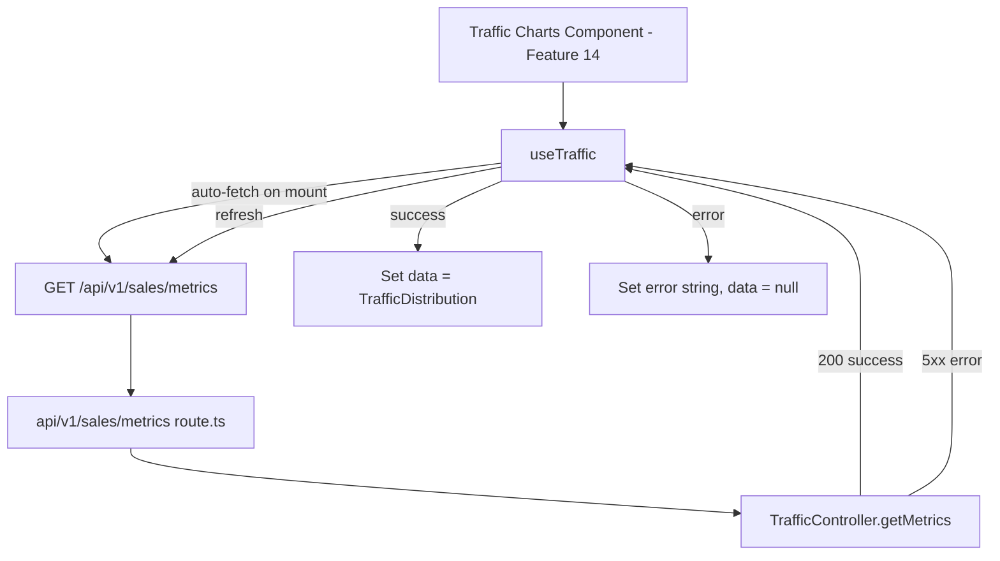

# Design - hook_manager_traffic (Feature ID: 13)

## Affected Files

- [UPDATE] `src/hooks/use-traffic.hook.ts` — Rewrite to call `/api/v1/sales/metrics` and return `TrafficDistribution` data with loading/error/refresh states.
- [NEW] `tests/integration/hook-manager-traffic.integration.test.ts` — Vitest integration tests for loading toggles, fetch payload, success caching, error handling, and refresh behavior.

## Public Interface

```typescript
import type { TrafficDistribution } from "@/backend/types/models.type";

interface UseTrafficResult {
  data: TrafficDistribution | null;
  loading: boolean;
  error: string | null;
  refresh: () => Promise<void>;
}
```

Export `useTraffic(): UseTrafficResult` from `src/hooks/use-traffic.hook.ts` with `"use client"` directive.

## Architecture & Data Flow

The hook replaces the existing placeholder `use-traffic.hook.ts` (which called `/api/traffic` with a `TrafficSummary` shape). It now targets the F12 endpoint `/api/v1/sales/metrics` and returns the `TrafficDistribution` shape.



### Request / Response Contract

Aligned with Feature 12 (`api_traffic_metrics_route`):

- **Request**: `GET /api/v1/sales/metrics`, no body or query params.
- **Success**: HTTP `200`, body `{ success: true, data: TrafficDistribution }`.
- **Failure**: HTTP `500`, body `{ success: false, status: number, error: string }`.

### TrafficDistribution Shape (from F10/F12)

```typescript
interface TrafficDistribution {
  hours: number[];         // 24 buckets (0-23)
  weekdays: number[];      // 7 buckets (0=Sun through 6=Sat)
  peakHour: number;        // index of highest hour bucket
  peakWeekday: number;     // index of highest weekday bucket
  totalTransactions: number;
}
```

## Implementation Decisions

- **Replace existing hook**: The current `use-traffic.hook.ts` calls `/api/traffic` and returns `TrafficSummary` + `TrafficRecord[]` — neither endpoint nor shape matches F12. The hook is rewritten in-place to match the new API contract.
- **Auto-fetch on mount**: Uses `useEffect` with `setTimeout(..., 0)` to avoid synchronous setState during mount (same pattern as existing hook).
- **Manual refresh**: `refresh` callback reuses the same fetch logic as auto-fetch, exposed via `useCallback`.
- **No client-side validation**: The API route and controller handle all validation; the hook surfaces API error messages directly.
- **Caching**: `data` persists in state between refreshes; only overwritten on successful fetch.

## Testing Strategy

`vitest.config.mts` defaults to `environment: 'node'`. The hook test file MUST declare `// @vitest-environment jsdom` at the top so `renderHook` can run.

Tests use `@testing-library/react` `renderHook` + `act` and mock `global.fetch`. Cases:
- R2/R3: Auto-fetch triggers on mount, loading toggles true→false.
- R4: Success response sets `data` with `TrafficDistribution` shape, clears `error`.
- R5: Error response (non-200) sets `error`, clears `data`.
- R6: Network throw sets generic `error`, clears `data`.
- R7: `refresh()` re-fetches and updates state.
- R8: All cases covered with mocked responses.

Consistent with `docs/verification.md` — no Vitest component rendering; Playwright covers UI in Features 14–16.

## Next.js Docs Consulted

- `node_modules/next/dist/docs/01-app/02-guides/testing/index.md` — Hook testing category and tooling guidance.

## Rejected Alternatives

- **Create new hook file alongside existing one**: Rejected; the existing `use-traffic.hook.ts` is a placeholder for this feature. Rewriting in-place avoids orphaned code and naming confusion.
- **Import `TrafficController` directly in the hook**: Rejected; violates layer isolation (`docs/conventions.md`). Hooks must call HTTP routes only.
- **SWR or React Query**: Rejected; overengineering for a single-endpoint fetch. Simple `useState` + `useEffect` is sufficient.
