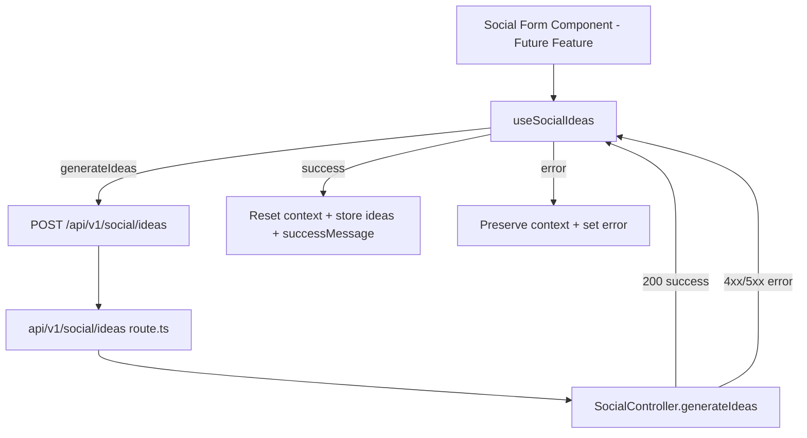

# Design - hook_social_content (Feature ID: 35)

## Affected Files

- [NEW] `src/hooks/use-social.hook.ts` — Client hook orchestrating social ideas form state, loading flags, and idea-generation fetch.
- [NEW] `tests/integration/hook_social_content.test.ts` — Vitest integration tests for loading toggles, fetch payload, success resets, and error preservation.

## Public Interface

```typescript
interface UseSocialIdeasResult {
  context: string;
  ideas: SocialIdea[];
  loading: boolean;
  error: string | null;
  successMessage: string | null;
  setContext: (value: string) => void;
  generateIdeas: () => Promise<void>;
}
```

Export `useSocialIdeas(): UseSocialIdeasResult` from `src/hooks/use-social.hook.ts` with `"use client"` directive. Import `SocialIdea` as a type-only import from `@/backend/types/models.type`.

## Architecture & Data Flow

The hook follows the same frontend abstraction pattern as `use-cashier-sales.hook.ts`: components remain presentational; all `fetch` orchestration lives in the hook.



### Request / Response Contract

Aligned with Feature 33 (`api_social_ideas_route`) and Feature 34 (`controller_social_ideas`):

- **Request**: `POST /api/v1/social/ideas`, `Content-Type: application/json`, body `{ context: string }` (minimum 3 chars).
- **Success**: HTTP `200`, body `{ success: true, data: { ideas: SocialIdea[] } }`.
- **Failure**: HTTP `400` or `500`, body `{ success: false, status: number, error: string }`.

Use `SocialIdea` from `@/backend/types/models.type` for typed success `data` only (type import is allowed; no model or controller imports).

## Implementation Decisions

- **String form field**: `context` is stored as `string` to support text input binding in the future UI component; validation (minimum 3 chars) happens server-side in `SocialController`, and the hook surfaces API error messages.
- **Success state**: `successMessage` is a short fixed string (e.g. `"Ideas generated successfully"`) set on success and cleared when a new `generateIdeas` starts.
- **No client-side validation**: Validation stays in `SocialController` (Feature 34); the hook surfaces API error messages.
- **Fetch target**: Hard-code `/api/v1/social/ideas` (same pattern as `useCashierSales` hard-coding `/api/v1/sales/record`).
- **`ideas` reset**: On successful fetch the ideas array is overwritten with the new response; on error it remains unchanged.

## Testing Strategy

`vitest.config.mts` defaults to `environment: 'node'`. The hook test file MUST declare `// @vitest-environment jsdom` at the top so `renderHook` can run without changing global Vitest config.

Tests use `@testing-library/react` `renderHook` + `act` and mock `global.fetch`. This verifies hook state integration (loading toggles, form resets) without rendering social UI components — consistent with `docs/verification.md` (no Vitest component/page rendering; Playwright covers UI in future features).

## Next.js Docs Consulted

- `node_modules/next/dist/docs/01-app/02-guides/testing/index.md` — Hook testing category and tooling guidance.

## Rejected Alternatives

- **Import `SocialController` directly in the hook**: Rejected; violates layer isolation (`docs/conventions.md`). Hooks must call HTTP routes only.
- **Vitest `node` environment without React**: Rejected; cannot exercise `useState`/`useCallback` lifecycle without a minimal React test runtime.
- **Playwright for hook state**: Rejected for this feature; E2E is reserved for the future social UI component feature.
