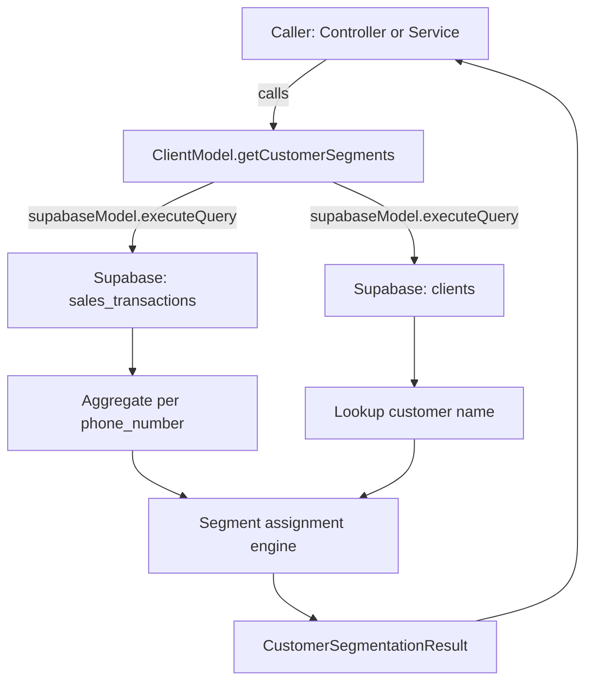

# Design - model_customer_segmentation (Feature ID: 20)

## Affected Files

| Action | File | Reason |
|--------|------|--------|
| MODIFY | `src/backend/types/models.type.ts` | Add `CustomerSegment` union type, `SegmentedCustomer` interface, `SEGMENTATION_THRESHOLDS` constants, and `CustomerSegmentationResult` interface |
| MODIFY | `src/backend/models/client.model.ts` | Add static method `getCustomerSegments` to `ClientModel` class |
| NEW | `tests/integration/model_customer_segmentation.integration.test.ts` | Integration tests for requirement verification |

## Public Interfaces

### Types added to `src/backend/types/models.type.ts`

```typescript
export type CustomerSegment = 'inactive_30d' | 'high_spender' | 'frequent';

export interface SegmentedCustomer {
  phone_number: string;
  name: string;
  visit_count: number;
  average_ticket: number;
  last_transaction_date: string | null;
  segment: CustomerSegment | null;
}

export interface CustomerSegmentationResult {
  segments: SegmentedCustomer[];
  summary: Record<CustomerSegment | 'unassigned', number>;
}

export const SEGMENTATION_THRESHOLDS = {
  INACTIVE_DAYS: 30,
  FREQUENT_VISIT_COUNT: 5,
  HIGH_SPENDER_MIN_TICKET: 50,
} as const;
```

### Method signature added to `ClientModel`

```typescript
static async getCustomerSegments(): Promise<CustomerSegmentationResult>
```

## Segmentation Algorithm

The method follows these steps:

1. **Fetch raw transactions**: Query all rows from `sales_transactions` table via `supabaseModel`.
2. **Aggregate per customer**: Group by `phone_number` to compute `visit_count` (count of rows), `average_ticket` (mean of `amount`), and `last_transaction_date` (max `created_at`). Look up `name` from the `clients` table if available.
3. **Assign segment tags** (mutually exclusive, deterministic priority):

```text
FOR EACH customer aggregate:
  IF last_transaction_date is null
    OR last_transaction_date < NOW() - SEGMENTATION_THRESHOLDS.INACTIVE_DAYS days
    → tag = 'inactive_30d'
  ELSE IF visit_count >= SEGMENTATION_THRESHOLDS.FREQUENT_VISIT_COUNT
    → tag = 'frequent'
  ELSE IF average_ticket >= SEGMENTATION_THRESHOLDS.HIGH_SPENDER_MIN_TICKET
    → tag = 'high_spender'
  ELSE
    → tag = null (unassigned)
```

4. **Build result**: Populate `SegmentedCustomer[]` array and compute the `summary` counts.

## Data Flow



## Error Handling

- **Connection failure**: The method catches network/database errors and re-throws a descriptive error code string (e.g. `'DB_CONNECTION_FAILURE'`), consistent with the pattern established in `SalesModel`.
- **Empty database**: No special edge case — zero rows yields empty aggregates, which yields `inactive_30d` for no customers or an empty result if no records exist in either table.
- **Missing client names**: If a transaction's `phone_number` has no matching row in the `clients` table, the `name` field in `SegmentedCustomer` defaults to an empty string.

## Rejected Alternative: Segmentation in a Service

**Alternative**: Place the segmentation logic in a new `segmentation.service.ts` file under `src/backend/services/`.

**Rejected because**: The acceptance criteria explicitly names the model as the clustering owner ("Implements aggregate querying algorithms in ... client.model.ts"). Splitting the raw aggregation query (model) from the tagging logic (service) introduces unnecessary indirection for a single-method feature. The segmentation rules are deterministic, data-local transformations that stay cohesive with the query. If the rules grow beyond three segments with complex cross-references, extracting a service is warranted and should be done in a follow-up feature.

## Next.js Docs Consulted

No Next.js framework-specific docs were consulted. This feature is entirely inside the isolated backend layer (`src/backend/`) and has no App Router, server component, or client component scope.
