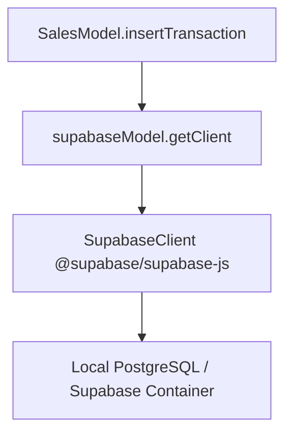

# Design - model_sales_insert (Feature ID: 2)

## Affected Files
- [MODIFY] [package.json](file:///Users/juarpla/Documents/Code%20Practice/loyalty/package.json): Add `@supabase/supabase-js` dependency.
- [MODIFY] [models.type.ts](file:///Users/juarpla/Documents/Code%20Practice/loyalty/src/backend/types/models.type.ts): Add `SalesTransaction` interface.
- [MODIFY] [supabase.model.ts](file:///Users/juarpla/Documents/Code%20Practice/loyalty/src/backend/models/supabase.model.ts): Initialize and expose a real `@supabase/supabase-js` client when credentials are present.
- [NEW] [sales.model.ts](file:///Users/juarpla/Documents/Code%20Practice/loyalty/src/backend/models/sales.model.ts): Pure model DAO class containing the write insertion logic.
- [NEW] [model-sales-write.integration.test.ts](file:///Users/juarpla/Documents/Code%20Practice/loyalty/tests/integration/model-sales-write.integration.test.ts): Integration tests to verify standard execution and error handling against local Supabase.

## Architecture & Data Flow
Following Decoupled MVC, the controller or service layer calls the Model layer to save transactions. The Model interacts with the database layer (`supabase.model.ts`) which instantiates the `@supabase/supabase-js` client.

## Decisions & Alternatives
- **Library Selection**: Using the official `@supabase/supabase-js` SDK is the standard, type-safe approach for working with Supabase/PostgREST.
- **Error Handling**: Connection failures and database errors (such as bad inputs or table name mismatches) are caught. We map network-level failures explicitly to a standard `'DB_CONNECTION_FAILURE'` string code so other layers can handle it elegantly.
- **Offline / Simulation Mode**: We preserve the project's requirement of simulation fallback when no Supabase env variables exist, making local frontend testing seamless without a database container.
