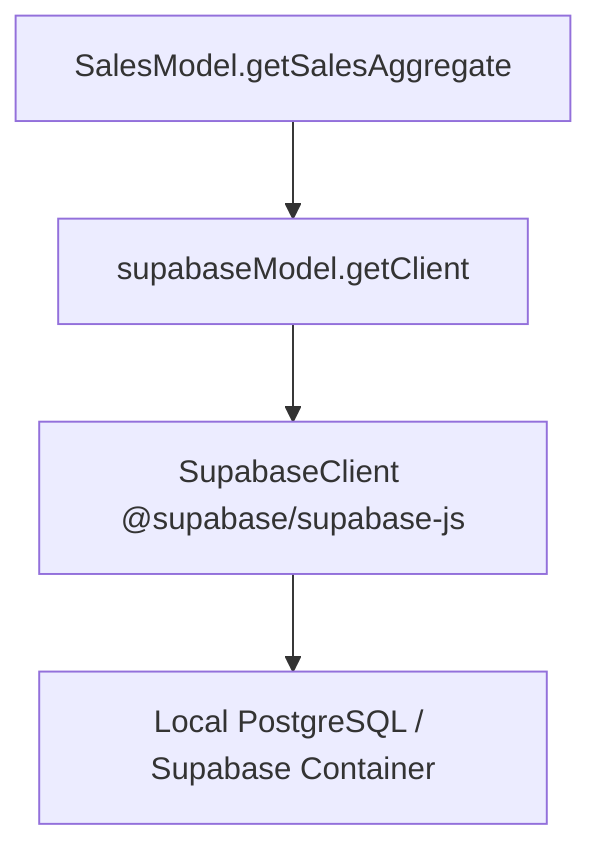

# Design - model_sales_query (Feature ID: 3)

## Affected Files
- [MODIFY] [models.type.ts](file:///Users/juarpla/Documents/Code%20Practice/loyalty/src/backend/types/models.type.ts): Add `SalesAggregate` type interface.
- [MODIFY] [sales.model.ts](file:///Users/juarpla/Documents/Code%20Practice/loyalty/src/backend/models/sales.model.ts): Add the read aggregate query method `getSalesAggregate` inside `SalesModel`.
- [NEW] [model-sales-read.integration.test.ts](file:///Users/juarpla/Documents/Code%20Practice/loyalty/tests/integration/model-sales-read.integration.test.ts): Integration tests to verify standard execution and error handling against local Supabase.

## Architecture & Data Flow
Following Decoupled MVC, controllers/services call `SalesModel.getSalesAggregate` which queries `supabaseModel`.

## Decisions & Alternatives
- **Aggregation Strategy**: We retrieve amounts for a given phone number using PostgREST `select("amount")` filtered by `.eq("phone_number", phoneNumber)`. Aggregating records using Javascript `reduce` is highly efficient, type-safe, and avoids complex PostgreSQL function/RPC overhead at this stage.
- **Offline / Simulation Mode**: We preserve the project's requirement of simulation fallback when no Supabase env variables exist, making local frontend testing seamless without a database container. For `"123456789"`, we return mock data with 5 visits and $25.5 average ticket size, and zeros for others.
- **Error Handling**: Connection failures and database errors (such as bad inputs) are caught. We map network-level failures explicitly to a standard `'DB_CONNECTION_FAILURE'` string code.
