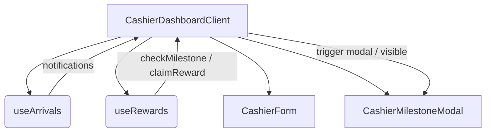

# Design: page_cashier_dashboard_milestones

Feature ID: 63
Feature name: page_cashier_dashboard_milestones
Title: Cashier Dashboard Page Layout Extensions

## Component Hierarchy & State Flow

The Cashier Dashboard page uses Next.js App Router. The client logic lives in `src/app/admin/cash/cashier-dashboard.client.tsx`.

We will extend `cashier-dashboard.client.tsx` to:
1. Integrate `useArrivals` to fetch the recent portal logins.
2. Integrate `useRewards` to handle checking and claiming milestones.
3. Keep track of checked arrivals in a React `useRef` array or set (`checkedArrivalsRef`) to prevent duplicate API checks for the same `loginId` or `clientId` session.
4. Set up a `useEffect` that monitors `notifications`. When a new arrival appears at `notifications[0]`, the effect checks if its `loginId` has already been evaluated. If not, it marks it as checked and calls `checkMilestone(notifications[0].clientId)`.
5. Mount the `CashierMilestoneModal` within the JSX hierarchy, passing dynamic customer data from the latest notification, along with rewards hook handlers.



## Public Interfaces & Props Mapping

We will render the modal component imported from `@/components/cashier/milestone-modal.component`:

```tsx
import { CashierMilestoneModal } from "@/components/cashier/milestone-modal.component";
import { useArrivals } from "@/hooks/use-arrivals.hook";
import { useRewards } from "@/hooks/use-rewards.hook";
```

JSX integration inside `CashierDashboardClient`:

```tsx
const { notifications } = useArrivals();
const {
  modalVisible,
  loading: rewardsLoading,
  checkMilestone,
  claimReward,
  dismissModal,
  successMessage: rewardsSuccess,
  error: rewardsError,
} = useRewards();

const checkedArrivalsRef = useRef<Set<string>>(new Set());

useEffect(() => {
  const latestArrival = notifications[0];
  if (!latestArrival) return;

  const sessionKey = `${latestArrival.clientId}-${latestArrival.loginId}`;
  if (!checkedArrivalsRef.current.has(sessionKey)) {
    checkedArrivalsRef.current.add(sessionKey);
    void checkMilestone(latestArrival.clientId);
  }
}, [notifications, checkMilestone]);
```

## UI Message Banners Integration
The dashboard has existing banners for `successMessage` and `error` from `useCashierSales`. We will combine or show separate banners for rewards actions (e.g. `rewardsSuccess` and `rewardsError` banners) under the header so they are fully visible to the cashier:
- Render a green banner for `rewardsSuccess` using the same markup style as `successMessage`.
- Render a red banner for `rewardsError` using the same markup style as `error`.

## Next.js Guides Consulted
- Server and Client Components: `node_modules/next/dist/docs/01-app/01-getting-started/05-server-and-client-components.md`
- Layouts and pages: `node_modules/next/dist/docs/01-app/01-getting-started/03-layouts-and-pages.md`

## Rejected Alternatives
- **Automatic trigger on sales record**: Only checking milestone eligibility when the cashier registers a sale.
  - *Tradeoff*: If a customer connects to the WiFi but does not purchase immediately (or is waiting in line), the cashier won't see their milestone status beforehand. By monitoring captive portal arrivals, the cashier is notified of milestones the moment the customer logs in.
