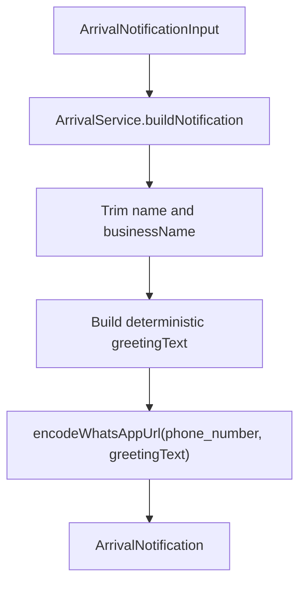

# Design — service_arrival_notification_builder (Feature ID: 52)

## Affected Files

- `src/backend/services/arrival.service.ts` — Create a pure backend service that builds arrival greeting notification payloads.
- `src/backend/types/models.type.ts` — Add reusable arrival notification input/output interfaces.
- `tests/integration/service_arrival_notification_builder.integration.test.ts` — Add Vitest coverage for the service contract.

## Architecture

This feature belongs entirely to the backend service layer. It must not query Supabase, parse HTTP requests, or render UI. Future controller and route features will fetch recent portal logins, then call this service to transform those customer records into manager-facing arrival alerts.



## Public Interfaces

```typescript
export interface ArrivalNotificationInput {
  phone_number: string;
  name?: string;
  businessName?: string;
}

export interface ArrivalNotification {
  phone_number: string;
  name: string;
  greetingText: string;
  whatsappUrl: string;
  generatedAt: string;
}

export class ArrivalService {
  static buildNotification(input: ArrivalNotificationInput): ArrivalNotification;
}
```

## Behavior

- `phone_number` is returned exactly as provided so downstream consumers can display the captured portal phone value.
- `name` is trimmed. If absent or blank, the returned `name` is an empty string.
- `businessName` is trimmed. If absent or blank, the greeting uses `"nuestro negocio"`.
- Named greeting text uses the form: `Hola <name>, gracias por visitarnos en <business>. Estamos felices de verte de nuevo.`
- Generic greeting text uses the form: `Hola, gracias por visitarnos en <business>. Estamos felices de verte.`
- `whatsappUrl` is produced by calling `encodeWhatsAppUrl(input.phone_number, greetingText)` from `src/backend/utils/whatsapp.utils.ts`.
- `generatedAt` is an ISO timestamp created when the notification is built.

## Error Handling

The service is a pure formatter and does not throw for empty names, empty business names, or phone numbers containing symbols. Phone sanitation and URL encoding remain delegated to `encodeWhatsAppUrl`, which already strips non-digits and percent-encodes text.

## Testing Strategy

The integration test suite will cover:

- Personalized output with `name` and `businessName`.
- Generic output when `name` is blank or missing.
- Default business label when `businessName` is blank or missing.
- Trimming of padded `name` and `businessName`.
- `whatsappUrl` creation through the existing encoder, verified by exact output or a module spy.
- `generatedAt` parseability as a valid ISO timestamp.

## Decisions & Alternatives

| Decision | Chosen approach | Alternative considered | Rationale |
| --- | --- | --- | --- |
| Service shape | Static method on `ArrivalService` | Free function export | Existing backend services use class-based static methods, so this keeps local patterns consistent. |
| URL builder | Delegate to `encodeWhatsAppUrl` | Reimplement `wa.me` encoding in this service | Reuse prevents duplicated phone sanitization and aligns with the completed WhatsApp URL utility feature. |
| Data fetching | No database access in this feature | Query `wifi_logins` directly from the service | Fetching arrival rows belongs to the next controller/model-facing feature, while this service only transforms customer details into notification payloads. |

## Next.js Docs Consulted

No Next.js-specific guide is required for this feature because it adds a pure TypeScript backend service with no App Router, React, or rendering surface.
