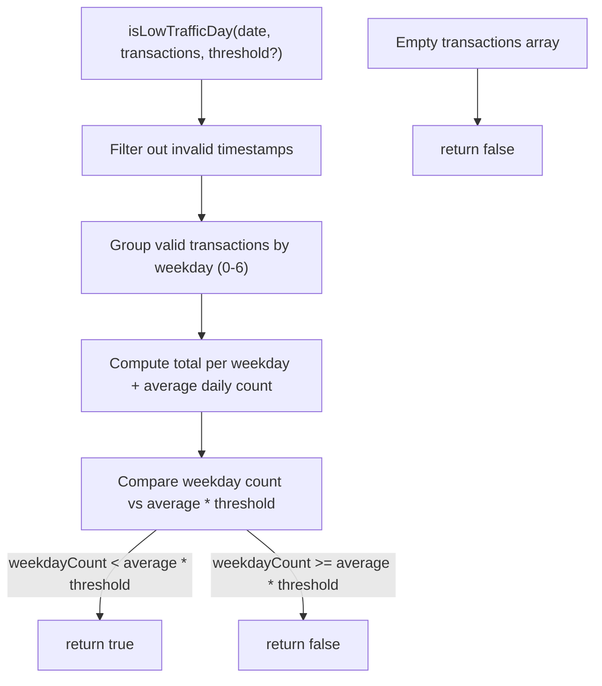

# Design - service_low_traffic_detector (Feature ID: 37)

## Affected Files

| File | Action | Description |
|------|--------|-------------|
| `src/backend/services/traffic.service.ts` | **Modify** | Add `isLowTrafficDay` static method to the existing `TrafficService` class |
| `tests/integration/service_low_traffic_detector.test.ts` | **Create** | Integration tests asserting low-traffic detection logic |

No new types, models, controllers, routes, or UI components are needed. The method returns a simple `boolean`.

## Architecture & Data Flow

This is a pure addition to the existing `TrafficService` class (pure backend service, no DB/HTTP dependencies). It follows the same pattern as `TrafficService.computeDistribution`:

1. Receive a `Date` and an array of `TransactionRecord[]` and an optional threshold.
2. Group transaction records by weekday index (0-6).
3. Compute the total transactions per weekday and the average daily transaction count.
4. Compare the target weekday's count against `averageDailyCount * threshold`.
5. Return a boolean.



## Public Interface

```typescript
// Added to existing TrafficService class in src/backend/services/traffic.service.ts

/**
 * Determines if a given date falls on a historically low-traffic weekday.
 * @param date - The target date to evaluate.
 * @param transactions - Historical transaction records to analyze.
 * @param threshold - Fraction of average daily transactions below which
 *                    a weekday is considered low-traffic (default: 0.5).
 * @returns `true` if the weekday historically has below-threshold traffic,
 *          `false` otherwise. Returns `false` for empty input.
 */
static isLowTrafficDay(
  date: Date,
  transactions: TransactionRecord[],
  threshold: number = 0.5,
): boolean
```

### Algorithm Detail

1. **Input validation**: If `transactions` is empty, return `false` immediately.
2. **Timestamp parsing**: Iterate through transactions. For each record, parse `created_at`. If `isNaN(new Date(tx.created_at).getTime())`, skip that record.
3. **Weekday grouping**: For valid timestamps, increment the corresponding weekday bucket (using `getDay()`: Sunday=0, Monday=1, ..., Saturday=6).
4. **Average calculation**: Compute `totalValidTransactions / 7` to get the average daily count.
5. **Threshold comparison**: Get the target date's weekday via `date.getDay()`. Compare:
   - `weekdayCounts[targetWeekday] < averageDailyCount * threshold` → return `true`
   - Otherwise → return `false`

## Error Handling

- **Invalid timestamps**: Silently skipped (no throw, no error log). Matches the established pattern in `TrafficService.computeDistribution`.
- **Empty input**: Returns `false` — conservative choice: insufficient data should not trigger flash-sale decorations.
- **Zero average daily count**: If all transactions have valid timestamps but average daily count is `0` (only possible if all transactions fall on a single day, making average = total/7 > 0), the math still works. If total valid transactions is 0 after filtering, the method returns `false` via the empty-input check.

## Decisions & Alternatives

- **Threshold as fraction of daily average (default 0.5)**: A weekday is "low traffic" if its transaction count is less than half the average across all days. This is intuitive and adapts to varying business volumes (a quiet day in a busy store still has absolute volume; this threshold normalizes against the store's own data). The threshold is configurable so downstream consumers can tune sensitivity.

- **Rejected Alternative — Absolute threshold**: A fixed number (e.g., "fewer than 10 transactions"). This doesn't scale with the business — a weekday with 9 transactions in a store that averages 100/day might be low, but 9 in a store that averages 20/day is normal.

- **Rejected Alternative — Percentage of peak weekday**: Comparing against the busiest day instead of the average. This would be too strict: a store with one very busy day could classify all other days as "low traffic", making the flag useless for promotional decisions.

- **Rejected Alternative — Separate service class**: Creating a standalone `LowTrafficDetectorService` instead of adding to `TrafficService`. Since the method operates on the same `TransactionRecord` input and follows the same computational pattern as `computeDistribution`, keeping it in `TrafficService` avoids unnecessary class proliferation and keeps related traffic analysis logic together.

## Next.js Docs Consulted

- No Next.js-specific documentation was needed since this is a pure backend service addition with no React, routing, or rendering concerns. The method follows the Decoupled MVC pattern documented in `docs/architecture.md` where services handle pure business logic.
