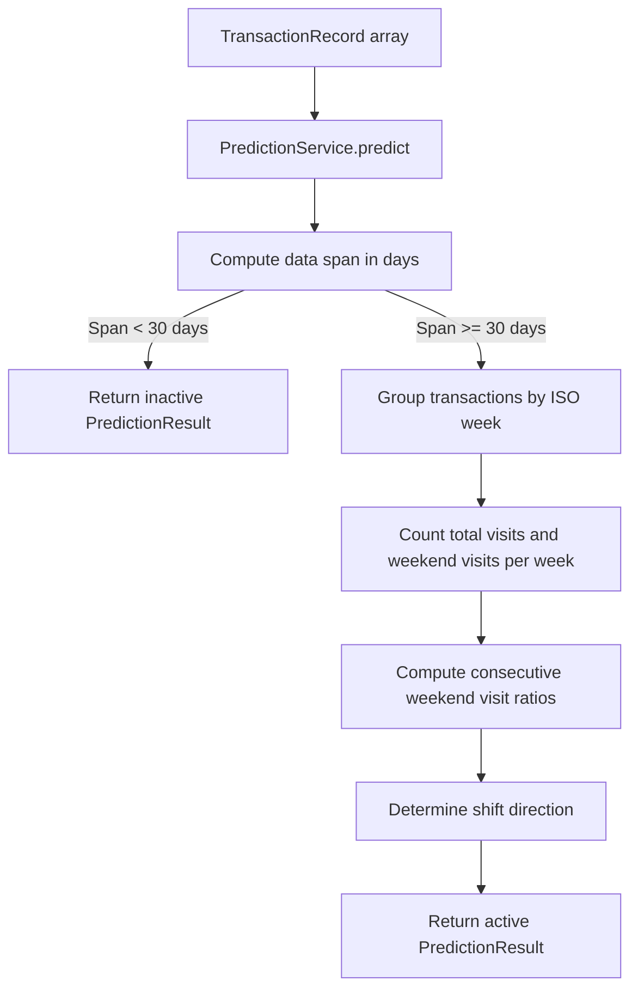

# Design - service_predictive_alerts (Feature ID: 17)

## Affected Files

- [NEW] `src/backend/services/prediction.service.ts`: Pure backend service computing week-over-week visit ratios and weekend alert projections.
- [MODIFY] `src/backend/types/models.type.ts`: Add `WeekVisitCount`, `WeekendRatio`, and `PredictionResult` interfaces.
- [NEW] `tests/integration/service_predictive_alerts.test.ts`: Integration tests asserting active/inactive boundaries, ratio correctness, and projection logic.

## Architecture & Data Flow

This is a pure backend service with no database or HTTP dependencies. It receives an array of `TransactionRecord` objects and returns a computed `PredictionResult`. The controller (future feature) is responsible for fetching transactions from `SalesModel.getAllTransactions()` and passing them to this service.



## Public Interface

```typescript
export interface WeekVisitCount {
  weekLabel: string;       // ISO week label e.g. "2026-W21"
  weekStart: string;       // ISO date of week start (Monday)
  weekEnd: string;         // ISO date of week end (Sunday)
  totalVisits: number;     // Total transactions in this week
  weekendVisits: number;   // Transactions on Saturday + Sunday
}

export interface WeekendRatio {
  currentWeek: string;      // ISO week label of the later week
  previousWeek: string;    // ISO week label of the earlier week
  visitRatio: number;      // Raw ratio: currentWeekweekendVisits / previousWeekweekendVisits
  percentageChange: number; // Percentage change rounded to 2 decimal places
}

export interface PredictionResult {
  status: "active" | "inactive";
  dataSpanDays: number;
  weekVisits: WeekVisitCount[];
  weekendRatios: WeekendRatio[];
  projectedWeekendShift: "increasing" | "decreasing" | "stable";
}

export class PredictionService {
  static predict(transactions: TransactionRecord[]): PredictionResult;
}
```

## Decisions & Alternatives

- **Pure Function Design**: The service takes `TransactionRecord[]` as input and returns `PredictionResult` without side effects, matching the pattern established by `TrafficService.computeDistribution`. This makes it trivially testable. The controller layer (future feature) will fetch data from `SalesModel` and pass it in.

- **30-Day Threshold**: The acceptance criteria specify "data spans over 30 days." We interpret "over 30 days" as `>= 30` days (i.e., 30 full days of data is sufficient to produce a prediction). The boundary is inclusive: exactly 30 days triggers active status. This avoids edge-case confusion at the exact threshold.

- **ISO Calendar Weeks**: Transactions are grouped by ISO 8601 year-week (e.g., `2026-W21`). Each ISO week starts on Monday and ends on Sunday. This is a standard, locale-independent grouping that aligns with JavaScript's `Date` methods and avoids ambiguity around week boundaries.

- **Weekend Definition**: Saturday and Sunday are defined as weekend days, following the業務 context of a local business predicting weekend traffic shifts. Weekday indices: Saturday = 6, Sunday = 0 (per JavaScript `getDay()`).

- **Percentage Change Formula**: `((current - previous) / previous) * 100` with special handling for division by zero (when previous week has 0 weekend visits, the change is recorded as `0` to avoid `Infinity`). This prevents misleading infinite-growth signals from zero-baseline weeks.

- **Projection Direction Threshold (5%)**: A 5% threshold is used to determine meaningful shift direction. This prevents minor fluctuations from triggering a projected increase or decrease, making the alert actionable.

- **Rejected Alternative - Rolling Window**: We considered using a rolling 7-day window instead of calendar weeks. However, calendar weeks align with the business cycle (Mon-Sun) and produce deterministic, comparable groupings that are easier for downstream consumers (controllers, UI) to interpret and display.

- **Rejected Alternative - Database-Level Aggregation**: Grouping transactions by week could be pushed to SQL using `date_trunc('week', created_at)`. However, keeping this in the service layer maintains testability with mocked data and follows the pattern established by `TrafficService`.

## Next.js Docs Consulted

- No Next.js-specific documentation was needed since this is a pure backend service with no React, routing, or rendering concerns. The service follows the Decoupled MVC pattern documented in `docs/architecture.md` where services handle pure business logic.