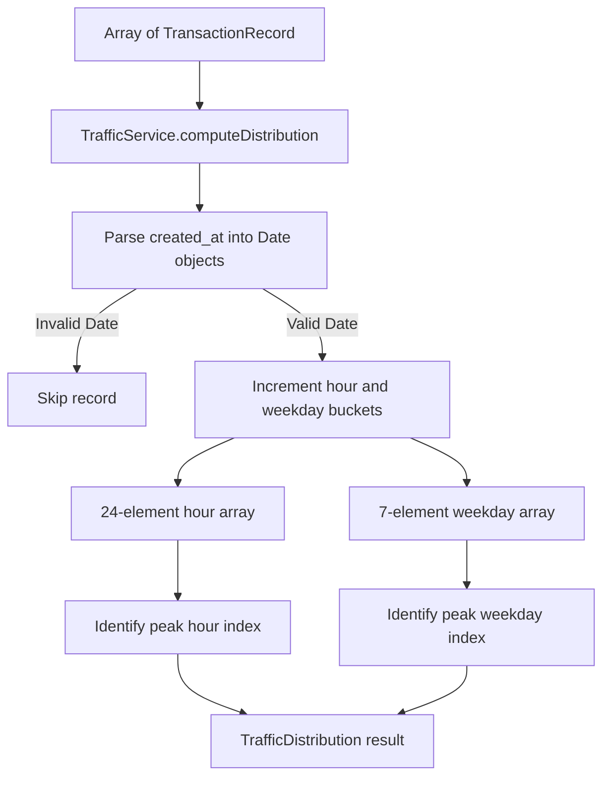

# Design - service_traffic_distribution (Feature ID: 10)

## Affected Files
- [NEW] [traffic.service.ts](file:///Users/juarpla/Documents/Code%20Practice/loyalty/src/backend/services/traffic.service.ts): Pure business logic service computing hourly and weekday transaction distributions.
- [MODIFY] [models.type.ts](file:///Users/juarpla/Documents/Code%20Practice/loyalty/src/backend/types/models.type.ts): Add `TrafficDistribution` and `TransactionRecord` interfaces.
- [NEW] [service-traffic-distribution.integration.test.ts](file:///Users/juarpla/Documents/Code%20Practice/loyalty/tests/integration/service-traffic-distribution.integration.test.ts): Integration tests verifying distribution correctness with mocked datasets.

## Architecture & Data Flow

This is a pure backend service with no database or HTTP dependencies. It receives an array of transaction records (each with a `created_at` timestamp) and returns a computed distribution object.



## Public Interface

```typescript
export interface TransactionRecord {
  id: string;
  phone_number: string;
  amount: number;
  created_at: string; // ISO 8601 timestamp
}

export interface TrafficDistribution {
  hours: number[];       // 24 elements, index 0 = midnight, index 23 = 11pm
  weekdays: number[];    // 7 elements, index 0 = Sunday, index 6 = Saturday
  peakHour: number;      // 0-23, hour with highest transaction count
  peakWeekday: number;   // 0-6, weekday with highest transaction count
  totalTransactions: number;
}

export class TrafficService {
  static computeDistribution(transactions: TransactionRecord[]): TrafficDistribution;
}
```

## Decisions & Alternatives

- **Pure Function Design**: The service is a static method that takes input and returns output without side effects. This makes it trivially testable and composable. No logger calls or external dependencies are needed since this is pure calculation logic.
- **Weekday Indexing (Sunday = 0)**: JavaScript's `Date.prototype.getDay()` returns 0 for Sunday through 6 for Saturday. We align with this native convention rather than remapping to Monday-first, which would add unnecessary complexity and potential for off-by-one errors.
- **Peak Hour/Weekday Tie-Breaking**: When two or more buckets share the same maximum count, the lower index wins (earliest hour or earliest weekday in the week). This is deterministic and requires no additional tie-breaking logic.
- **Rejected Alternative - Database-Level Aggregation**: We considered pushing the grouping logic into a SQL query using `EXTRACT(HOUR FROM created_at)` and `EXTRACT(DOW FROM created_at)`. However, this feature is scoped as a pure service-layer calculation. The controller layer (Feature 11) will be responsible for fetching raw transactions from the model and passing them to this service. Keeping the aggregation in TypeScript also makes it easier to unit-test with mocked data without a running database.
- **Empty Dataset Handling**: An empty input array returns all-zero buckets with `peakHour: 0`, `peakWeekday: 0`, and `totalTransactions: 0`. This is a safe default that downstream consumers (controllers, UI) can handle without null checks.
