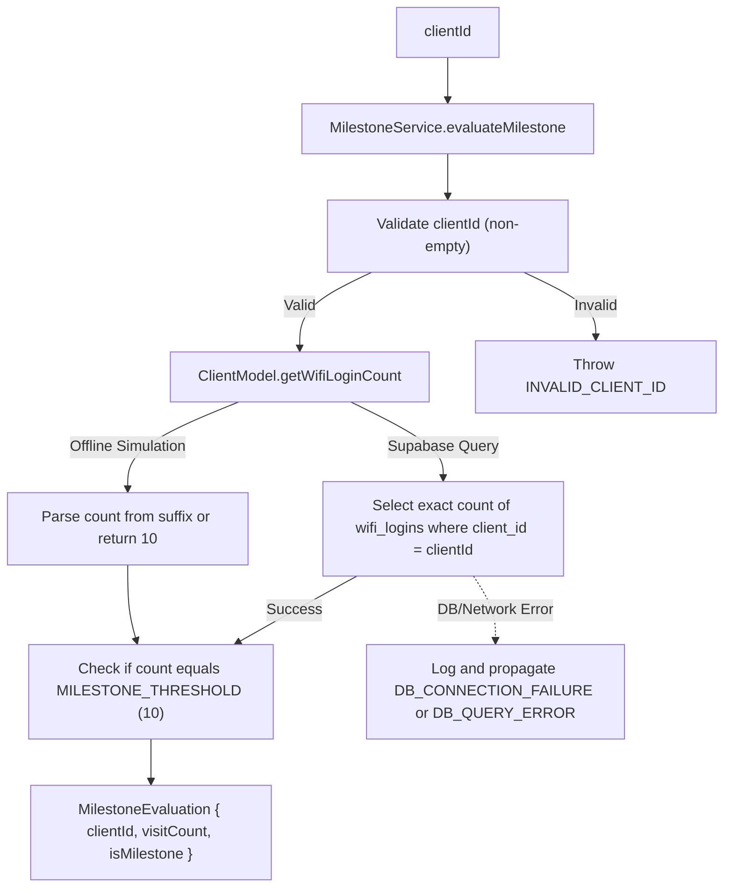

# Design — service_visit_milestone_counter (Feature ID: 58)

## Affected Files

- `src/backend/types/models.type.ts` — Define the `MilestoneEvaluation` interface and `MILESTONE_THRESHOLD` constant.
- `src/backend/models/client.model.ts` — Add a `getWifiLoginCount(clientId)` method querying the `wifi_logins` table, including simulation handling.
- `src/backend/services/milestone.service.ts` — Create the `MilestoneService` class to evaluate client milestones.
- `tests/integration/service_visit_milestone_counter.test.ts` — Create integration tests covering all requirements.

---

## Architecture

This feature resides in the isolated backend service and model layer. It implements a pure business evaluation service (`MilestoneService`) backed by an isolated database query wrapper in `ClientModel`. It is strictly decoupled from Next.js server-side pages, routing paths, controllers, and frontend view panels.



---

## Public Interfaces

### Interface & Constant Additions (`src/backend/types/models.type.ts`)

```typescript
export const MILESTONE_THRESHOLD = 10;

export interface MilestoneEvaluation {
  clientId: string;
  visitCount: number;
  isMilestone: boolean;
}
```

### Model Layer Additions (`src/backend/models/client.model.ts`)

```typescript
export class ClientModel {
  /**
   * Fetch count of wifi logins for a specific client.
   * In offline simulation mode, parses '-count-<num>' in clientId or defaults to 10.
   */
  static async getWifiLoginCount(clientId: string): Promise<number>;
}
```

### Service Layer Additions (`src/backend/services/milestone.service.ts`)

```typescript
export class MilestoneService {
  /**
   * Evaluates if the client has reached the 10th visit milestone.
   * Throws INVALID_CLIENT_ID if clientId is empty or whitespace.
   */
  static async evaluateMilestone(clientId: string): Promise<MilestoneEvaluation>;
}
```

---

## Behavior

1. **Validation:**
   - When `evaluateMilestone(clientId)` is called, the service asserts that `clientId` is defined and contains at least one non-whitespace character.
   - If invalid, it immediately throws `Error("INVALID_CLIENT_ID")`.

2. **Database Querying (`ClientModel.getWifiLoginCount`):**
   - **Production Mode:** Queries the `wifi_logins` table using the secure Supabase client:
     ```typescript
     const { count, error } = await client
       .from("wifi_logins")
       .select("*", { count: "exact", head: true })
       .eq("client_id", clientId);
     ```
   - **Offline Simulation Mode:** Checks if `clientId` contains `-count-` (e.g. `cli-count-15`). If matched, parses and returns the number. Otherwise, returns a default simulated count of `10`.

3. **Milestone Logic Evaluation:**
   - Evaluates the parsed count.
   - Sets `isMilestone` to `true` if and only if `count === 10` (matching `MILESTONE_THRESHOLD`). For any other number of visits (e.g., 9 or 11), `isMilestone` is `false`.
   - Returns a structured `MilestoneEvaluation` object.

---

## Error Handling

- **Validation Failures:** Invalid or blank `clientId` parameters yield a clean, explicit `INVALID_CLIENT_ID` error.
- **Database Failures:** If Supabase returns a query error or connection timeout, the model logs the failure using `logger.error` and maps it:
  - Errors containing `"fetch failed"`, `"ECONNREFUSED"`, `"Failed to fetch"`, or `"NetworkError"` are converted to `Error("DB_CONNECTION_FAILURE")`.
  - All other query errors are propagated as `Error("DB_QUERY_ERROR")`.

---

## Testing Strategy

The integration tests located in `tests/integration/service_visit_milestone_counter.test.ts` will verify:

1. **Service Interface Integrity:** Assert `evaluateMilestone` is exported, accepts `clientId`, and returns the correct type signature.
2. **Milestone Condition Boundaries:**
   - Verify `isMilestone` is `true` when visit count is exactly 10.
   - Verify `isMilestone` is `false` when visit count is 9.
   - Verify `isMilestone` is `false` when visit count is 11.
3. **Validation Guards:** Assert that calling the service with empty strings `""` or whitespace-only inputs `"   "` throws an `INVALID_CLIENT_ID` error.
4. **Offline Simulation Routing:** Verify that simulation counts are parsed correctly from `clientId` suffix values.
5. **Database Exception Wrapping:** Mock the Supabase client to throw network and general database errors, and assert that `ClientModel.getWifiLoginCount` correctly catches, logs, and transforms them into `DB_CONNECTION_FAILURE` or `DB_QUERY_ERROR`.

---

## Decisions & Alternatives

| Decision | Chosen approach | Alternative considered | Rationale |
| --- | --- | --- | --- |
| **Service Placement** | Decoupled model query + pure service orchestrator. | Inline the database query directly in the `MilestoneService`. | Adheres strictly to the project's **Decoupled MVC** architecture. Models handle database constraints, network modes, and offline simulation fallback, whereas services manage pure business calculations. |
| **Milestone Rule** | Check for exactly 10 visits. | Check for multiples of 10 (`count % 10 === 0`). | The F4 Story 4.3 requirements define milestone activation "exactly at the tenth accumulative log". Restricting checks to exactly 10 avoids redundant triggers before claims or resets are handled in subsequent features. |
| **Simulation Mode Routing** | Parse count from the `clientId` string (e.g., `cli-count-5`). | Keep a static count variable or dynamic mock database maps. | Parsing directly from the input ID is stateless, deterministic, and highly flexible, letting integration tests verify active/inactive states without complex global mocks or state mutation. |

---

## Next.js Docs Consulted

No Next.js-specific guides are required for this backend feature because it implements a pure TypeScript business service and database model extension with no rendering layouts, hydration logic, API routing wrappers, or client-side hooks.
