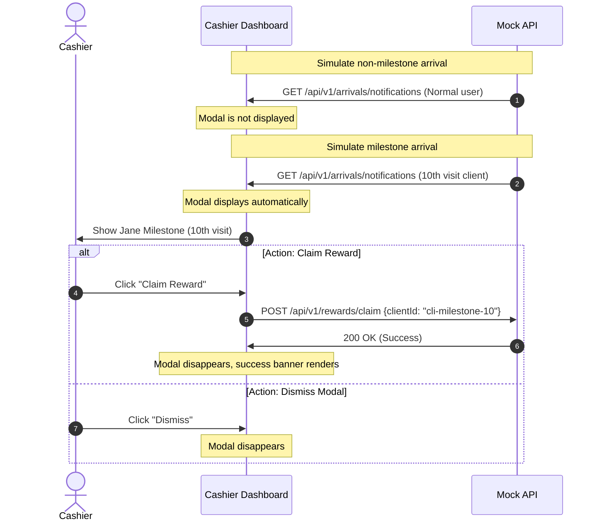

# Design: test_e2e_cashier_rewards_modal_flow

Feature ID: 64
Feature name: test_e2e_cashier_rewards_modal_flow
Title: Cashier Milestone Alert Modals E2E Tests

## Architecture & Test Approach

This E2E test suite validates the end-to-end integration flow of the milestone reward modal on the Cashier Dashboard.
To ensure tests are isolated, deterministic, and fast, we will intercept the backend API endpoints using Playwright's `context.route` or `page.route` capabilities.

### Routes and Interceptions

1. **`GET **/api/v1/arrivals/notifications`**:
   - Mocks the active portal logins stream. We can dynamically push non-milestone or milestone logins.
2. **`POST **/api/v1/rewards/claim`**:
   - Mocks the claim endpoint, verifying that correct parameters (`clientId`) are transmitted and responding with success payloads.

### User Flow Sequence

## Public Interfaces & Selectors

We use the following `data-testid` attributes to assert and interact with the UI:
- **`milestone-modal-overlay`**: The backdrop overlay of the milestone modal.
- **`milestone-modal-panel`**: The modal container panel.
- **`milestone-customer-name`**: Text element containing customer name.
- **`milestone-customer-phone`**: Text element containing customer phone number.
- **`milestone-reward-description`**: Text element detailing the reward description.
- **`milestone-visit-count`**: Text element displaying the cumulative visit count (10).
- **`milestone-claim-button`**: Button to trigger the claim operation.
- **`milestone-dismiss-button`**: Button to close the modal without claiming.
- **`rewards-success-banner`**: Banner showing success feedback after a reward is claimed.

## Next.js Guides Consulted
- Playwright E2E: `node_modules/next/dist/docs/01-app/02-guides/testing/playwright.md`

## Rejected Alternatives
- **Real Database / Supabase integration**: Doing E2E tests against live Supabase database.
  - *Tradeoff*: Slows down CI pipeline and requires complex state teardowns to reset visit counts precisely back to 9 and 10. Intercepting routes allows simulating state transitions instantly and deterministically.
