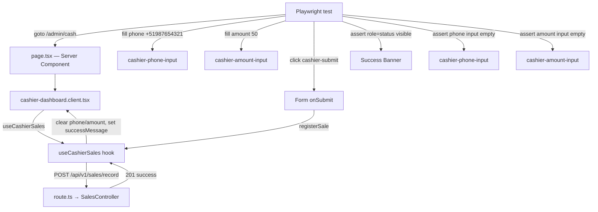

# Design - test_e2e_cashier_sales_flow (Feature ID: 9)

## Affected Files

- [NEW] `tests/e2e/cashier_sales_flow.e2e.test.ts` — Playwright E2E test file verifying the complete cashier sales registration workflow.

## Test Structure

```text
test.describe("Cashier Sales Registration Flow")
  ├── test: R1, R2 — Mobile (375 px): fill valid data, submit, assert success banner + form cleared
  ├── test: R3 — Mobile (375 px): submit with invalid phone, assert error banner
  └── test: R4 — Desktop (1440 px): fill valid data, submit, assert success banner + form cleared
```

## Test Data

| Scenario | Phone | Amount | Expected Result |
| --- | --- | --- | --- |
| Valid mobile | `+51987654321` | `50` | 201 success, form cleared, success banner |
| Valid desktop | `+51987654321` | `75` | 201 success, form cleared, success banner |
| Invalid phone | `123` | `50` | 400 error, error banner "Invalid phone number format" |

The valid phone `+51987654321` matches the controller regex `^(\+51\d{9}|\+(?!51)\d{7,15})$`. The invalid phone `123` fails the regex and triggers the controller's 400 validation error.

## Data Flow (Mobile Success Path)



## Test Implementation Details

### Mobile Success Test (R1, R2)

1. Set viewport to 375×667 (iPhone SE)
2. Navigate to `/admin/cash`
3. Fill phone input with `+51987654321` via `page.getByTestId("cashier-phone-input").fill()`
4. Fill amount input with `50` via `page.getByTestId("cashier-amount-input").fill()`
5. Click submit button `page.getByTestId("cashier-submit").click()`
6. Assert: `page.locator('[role="status"]')` is visible with text "Sale registered successfully"
7. Assert: phone input value is empty string
8. Assert: amount input value is empty string

**Note on touchpad vs keyboard input:** The mobile touchpad only provides digits 0-9 and backspace — no `+` symbol. Since a valid phone number requires a `+` prefix, the test fills the phone input via keyboard simulation (`fill()`) rather than touchpad taps. The amount input is also filled via keyboard for simplicity. The touchpad's interactive behavior is already covered by Feature 7's E2E tests; this feature focuses on the end-to-end API flow.

### Error Test (R3)

1. Set viewport to 375×667
2. Navigate to `/admin/cash`
3. Fill phone input with `123` (invalid format)
4. Fill amount input with `50`
5. Click submit button
6. Assert: `page.locator('[role="alert"]')` is visible with text "Invalid phone number format"

### Desktop Success Test (R4)

1. Set viewport to 1440×900
2. Navigate to `/admin/cash`
3. Fill phone input with `+51987654321`
4. Fill amount input with `75`
5. Click submit button
6. Assert: `page.locator('[role="status"]')` is visible
7. Assert: phone and amount inputs are empty

## Environment Dependencies

- **Dev server**: Playwright starts `pnpm dev` via `webServer` config in `playwright.config.ts`
- **Supabase**: The E2E tests require the local Supabase instance OR the app to be in `offline_simulation` mode. In `offline_simulation` mode, `SalesModel.insertTransaction` returns a mock record without hitting the database, making the API return 201 successfully.
- **Prerequisite**: Run `supabase start` before E2E tests, OR ensure `offline_simulation` mode is active (default when no Supabase connection is configured).

## Next.js Docs Consulted

- `node_modules/next/dist/docs/01-app/02-guides/testing/playwright.md` — Playwright setup with Next.js, `webServer` config, `baseURL` usage.

## Rejected Alternatives

- **Touchpad-only mobile test**: Rejected. The touchpad provides digits 0-9 and backspace only — no `+` key. A valid phone number requires `+51` prefix, which cannot be entered via touchpad alone. The keyboard input (`fill()`) is the correct method for entering complete valid phone numbers on mobile.
- **API route mocking in E2E**: Rejected. E2E tests exercise the full stack by design. Mocking the API route would convert the test into an integration test, defeating the purpose of E2E verification.
- **Testing only success flow**: Rejected. The acceptance criteria requires verifying both success and error states. Error flow (invalid phone) is essential to confirm the error banner renders correctly end-to-end.
