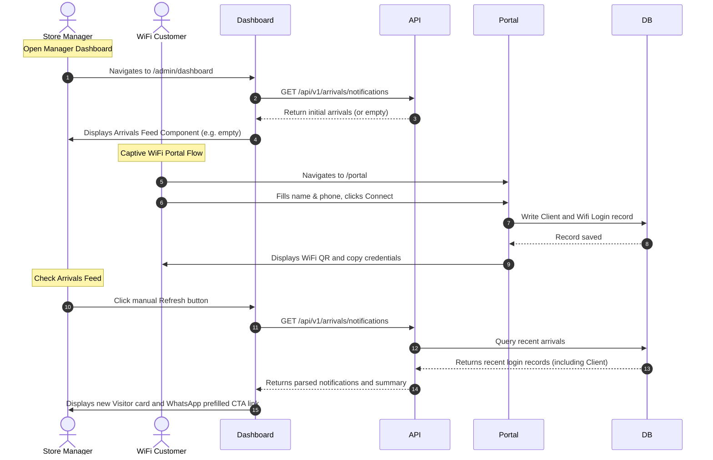

# Design - test_e2e_manager_arrivals_feed_flow (Feature ID: 57)

Feature 57 provides full integration E2E testing to prove that the Captive Portal registration flow seamlessly feeds live customer arrivals to the manager's live arrivals dashboard panel.

## Affected Files

| Type | Path | Purpose |
| --- | --- | --- |
| Edit | `src/app/admin/dashboard/dashboard.client.tsx` | Embed `ArrivalsFeedComponent` from `src/components/dashboard/arrivals-feed.component.tsx` and integrate the `useArrivals()` hook to pass live visitor state down to the presentation panel. |
| New | `tests/e2e/manager_arrivals_feed_flow.spec.ts` | Complete E2E integration test validating the flow from portal onboarding to manager feed display, verifying list appending, formatting, and WhatsApp URL generation. |

## Public Interface & Component Integration

In `src/app/admin/dashboard/dashboard.client.tsx`, the `ArrivalsFeedComponent` will be rendered. The code integration will look like:

```typescript
import { useArrivals } from "@/hooks/use-arrivals.hook";
import { ArrivalsFeedComponent } from "@/components/dashboard/arrivals-feed.component";

// Inside DashboardClient:
const {
  notifications,
  summary,
  loading: arrivalsLoading,
  error: arrivalsError,
  refresh: refreshArrivals,
} = useArrivals();

// Inside the render block, e.g. next to the TrafficChartComponent:
<main className="flex-1 px-4 py-8 max-w-2xl mx-auto w-full flex flex-col gap-8">
  <TrafficChartComponent data={data} loading={loading} error={error} />
  <ArrivalsFeedComponent
    notifications={notifications}
    summary={summary}
    loading={arrivalsLoading}
    error={arrivalsError}
    onRefresh={refreshArrivals}
  />
</main>
```

## Architecture and Data Flow



## Implementation & Testing Strategy

The E2E tests in `tests/e2e/manager_arrivals_feed_flow.spec.ts` will verify this complete scenario:

1. **State Verification / Preparation:**
   - Establish two pages or navigate sequentially to coordinate actions. Playwright supports multiple contexts/pages or simple sequential actions because the database stores persistent records.
   - For a deterministic E2E test, we can:
     1. Navigate to `/admin/dashboard` to verify it loads correctly (R1).
     2. Navigate to `/portal`, fill out the form with a unique random phone number (e.g., `+54911` followed by random digits to avoid duplicates) and name (e.g. "E2E Stream User"), and submit.
     3. Verify onboarding completion and database storage (R2).
     4. Navigate back to `/admin/dashboard` (or use a second tab/page).
     5. Click the manual refresh button on the Arrivals Feed (`data-testid="refresh-button"`).
     6. Assert that a card containing the user's name is appended to the top of the feed list (R3).
     7. Verify that the correct name, phone, greeting preview, and green WhatsApp button are rendered (R4).
     8. Verify that the WhatsApp action button's `href` is formatted correctly containing `https://wa.me/` with the prefilled greeting text (R5).

2. **Responsive Design Validation:**
   - Ensure the feed container scales nicely when rendering the real data in `dashboard.client.tsx` without clipping or overflowing viewports.

## Consulted local Next.js Docs

- `node_modules/next/dist/docs/01-app/01-getting-started/05-server-and-client-components.md`: Since `dashboard.client.tsx` is already a client component, adding `useArrivals` and rendering `ArrivalsFeedComponent` matches the client boundaries cleanly.
- `node_modules/next/dist/docs/01-app/02-guides/testing/playwright.md`: Standard Playwright conventions will be used to structure the integration flow assertions.
