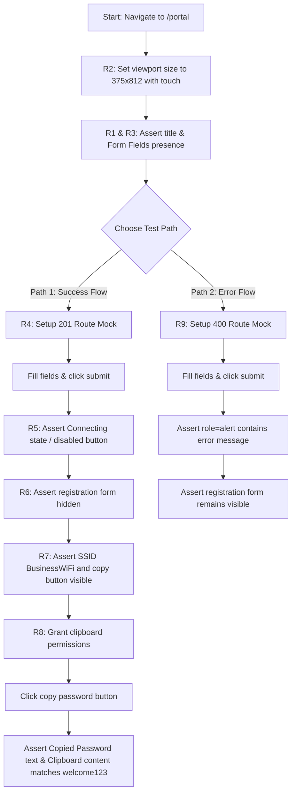

# Design — test_e2e_portal_onboarding_flow (Feature ID: 51)

## 1. Files Expected to Change / Be Created

- **`tests/e2e/portal_onboarding_flow.spec.ts`**: New E2E Playwright test suite defining tests mapped to requirements R1-R9.

---

## 2. Public Interfaces & Mocking Details

### 2.1 Route Target
- URL: `/portal`
- Page component: `src/app/portal/portal.client.tsx` (Client component) inside `src/app/portal/page.tsx` (Server component layout container).

### 2.2 Network Mocking
We intercept requests to the backend registration API using Playwright's `page.route`:
- **Endpoint**: `**/api/v1/portal/register`
- **Method**: `POST`
- **Success mock (201 Created)**:
  ```json
  {
    "success": true,
    "data": {
      "message": "Client registered successfully"
    }
  }
  ```
- **Error mock (400 Bad Request)**:
  ```json
  {
    "success": false,
    "error": "Invalid phone format"
  }
  ```

---

## 3. Detailed Data Flow & Test Strategies



### 3.1 Clipboard Permissions
Because Playwright runs inside a headless or headed browser environment, we must programmatically grant access to read and write to the system clipboard:
```typescript
await context.grantPermissions(["clipboard-read", "clipboard-write"]);
```
Then we can inspect the clipboard in the page context via:
```typescript
const text = await page.evaluate(() => navigator.clipboard.readText());
```

---

## 4. Local Guides & Next.js Documentation Consulted

- **Playwright Testing Guide**: `node_modules/next/dist/docs/01-app/02-guides/testing/playwright.md`
  - Recommends using `page.goto` inside a clean test runner.
  - Suggests testing mobile layout adaptations by setting custom viewport sizes.
  - Highlights isolation of database dependencies by mocking API layers to avoid environment instability.

---

## 5. Rejected Alternatives

- **Alternative 1: Direct Integration Test against Live local Supabase Docker**
  - *Why rejected*: Docker may not be running in the current CI or runner environments (e.g. locally, `./init.sh` reports that integration tests requiring docker/local supabase fail due to docker not running). If we rely on a running container, E2E tests become extremely flaky and fail during simple harness runs. Playwright's `page.route` intercepts the network completely and runs instantly without database side-effects.
